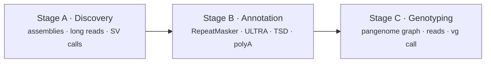

<p align="center"></p>

[](https://github.com/cgroza/GraffiTE/issues) [](https://www.nature.com/articles/s41467-024-53294-2) [![nextflow](https://img.shields.io/badge/powered_by:-Nextflow-9EE0CE?logo=data:image/png;base64,iVBORw0KGgoAAAANSUhEUgAAAIAAAACACAMAAAD04JH5AAAAXVBMVEX///8NwJ0AvZiw5Nbr+faD2seg49Xn9vK66t/n+PX2/fzj9/P8///w+/mv59qb4dHc9fBV0LYgxKNLzLA2yKnQ8eqR3sx11sDH7uVg0bhs0bho1L2n49VAyKsAuZFiHuhuAAAFqElEQVR4nO1b24KiMAyVCA6jgMhFcNT9/89crorSk6RQdx92z+MwJcc2zZ3NNqzT783fQHwowyTdUAcvD8L0z4mud9esk/tru/EGtCxOt/Ljwv0w6GQPUp8EBhZZUH9Q+uGWe6NsI4Gew/kzhxEnjfR3aXMC7V+9PHQuPg1m0iGB9kFxi1yKr08m8QyB5lHmjkJYGKXzBNpdcHMQZY7ECwSax/n6a+lXrASeQINgv05+kuGfryJAxZpNOFxY8RoCDc6LlTHkf76WAOWHReKjQBKvJNDcyCXH4EvbryfQwP5CpuL2WxGgnaX8UPleLQGPAiv5iebnWxHwqPqAfBsCHl3dy7cioN8DvXw7Alo9CPXyLQno7kJpIb8lQM8IUfH/csD4rRfeR8WbJjo/5moSYgpRaIUX1bZO48e69FioOBSCfJX9JS+oDR7ucM5kDsJVUFwAogBH3bX8Ayhh5H/Ly7MbH+KUJ9GFx3i1pADk7eTgohbcGF3g0qMU/wSq2CY6CwzQXRQOgHJ1xlXym5CBZfzp0VErvkHMvovOxkWCCbZMetljIN+0JONWFMYlHDiFMnqlG7cgX5BesC+cW+SI2QDKF0X2zB4YtoDhS/kS8Q2YuH6mBcwG0H1xeocN8+wiMFcgY0yngD1jWt9+VY7/c01yWeJ9fU1VcBhEtxXyOUV89QhQXRjPocMd/rKpGu6xCi5LbJ+Ah/Bi2qEKWjkAMyr07qlxgf8kRXAKHOAWPM8AngC5KHMh/ZokCTXcJQfy4RbQj8zRTZ3vCl6fjbYoQlaoWFliG4CMDI0RVoz2yBy42APYgocSQBVYawNGgOjokaOg6OnkSD48gzHM+QEE1xuhAdApxvxjd30PcA/oq3vqA/nL45AZdoBAf80P4Km+piQCKMFwDYAncqcCTc5ltvVDaApiBnLYAtybLcFwD5EhdmUFWpzMIi4cgcxlQ/hKRvS2vjI/XBEMzxEGRpw7AvVxZ0LitO/3H/889r4Z3cP4ywyXBFDu3TE4/zJeQ6eGCNmajgCqjrqcQgD+uOhsDXJGLsdBgCnuQ6IUEOBqupaIQczT+wIfELDrs7FIzfIHb4giIidpUQ90yn3cD5y1Z18ahADJ75h5/YANcnYNIqACNNx0cEmdJUZIzR/lL2QInCkBynzG8g8Ii52ZIngC4z2LQX3C1RmgAtCzcQG00FV6DszgmJltcDHPTYEC1smeFUCkpW7UEBWMJ5kPTE9dbAEswk7tDCyU3tcTgFXoYhJ2wxrJepcI+xAvdwyXatemJ8jTPe1wD1ysthk9MQC3LF4VHN6DlXqIq/Xv72UaFiuSVKhbzdm+ZX64b0/LbwKsUxvKH1zTammtBvmYDjPlBnWkjsGy6DCCk6hGP7dn2FpPorXwGfmGDRB6vfYFK3Yaz/g+rndrHxoI03jG4gc7wEJXq9iAH8ZEtoWdIKFCH6ClzCRyC3SxpSEuZQtTGiF58wJTwObZsFA1RCKO4jL6FPErW4sgOUc8hv4A1wpkbPfAgLhR7f1OMQlrGJ6YQDiEjkJlPog4uWqm2STvyhmDB4Vi98YhDc+FbqBPNOs4gnnl4FXJUEGp8sJTTxOS3IcS1eDBoRFanMqNzQCmKtXhpm/mNOxmSnXBjWKmfSkBpTFFvd7VBLR1t0gz17mAgH4aLVLvgQ0Bm7pjBJqpywnYONOOgWwSrQjQyTq4l3yqFQGqFpQ6EncEFtZ6StmzqghQtjS7i2VVVBCgy4rc7mj+xs6CAGkDOYBUmJOWCNBldd/lxgY5PAG6u/j+1K+Yc+AIUOaq5cGcAybg8oPLJkrJQcgDCDRRm8OGT4fS/NGpkQB5l098/2z8fmJGoP0IPHHZ+H9BOePwQqCNEi+hu0aPEekun8bAPYG+03oPtp//8rxFVN8ug8yOQJFXx239sW0H2JfhLTjdve1vxelFNYyeshsAAAAASUVORK5CYII=)](https://www.nextflow.io/) [](LICENSE)

[](https://www.docker.com/) [![apptainer](https://img.shields.io/badge/use_with:-apptainer-blue?logo=data:image/png;base64,iVBORw0KGgoAAAANSUhEUgAAACAAAAAgCAMAAABEpIrGAAAAxlBMVEX///8AAAAAlteWlpZttBP8kRQEBAT7+/vHx8fQ0NC5ubnZ7/mLw0Pg8vrBwcEKCgocHByoqKjm5ubv9+Y9r+Ha2tqgoKDs7OxpaWk9PT0lJSX8lR3y8vK84/SEzOtfveW02YbO5q+TyFF7uymS0u4Tntqm0W+j2fH5/PXZ68H1+u/s9eGezmNWueTq9vzB35rT6bi42oz+7dh9fX391KP9rlP8t2ZVVVX8oTf9qEaJiYkzMzNKSkr+8OBlZWUVFRX9xIL+3rqkQXPwAAABvklEQVQ4jY2SaV+CQBDGRxZESEVIVA5TS43u8j7Lvv+X6tlZQMheNC/4MTP/febYJTqb2b8ZNGg4HD3SH2b2BxNN066oruv67SXTaGtsCtD1u1H5+HiilQFdn14XgIHKtu9fiZKHqSLqSX6e85ObqyzwOGKZ+lPqj/l0o1gzYZXntD9Z/+W13HTyJokPLiD7b//Kw4ZylqdUYNK4yJN5C+Kd/+5fxpd5oof6B0/qF2J+DWYVArMZecKtxZnfqcDmeXqxjFZkCSFykbkE1jkQGcaGmgDMNOA5EqjmNbaGEZEtRCcL7CpsvcxfGoZRAvYKaJWAQgkbyUOAz+4MRNykpzbTQs6SlNNVwEY26QFostusQoBISqiiR1RYkimyGp8YwCZyAQQMrAAsSHbJi5AztqDtfQGUmkesIcKj8QG4kOjhpMi2FSBwgsBJ9uZyFx5aDLlUjD/Hom8pMOP9dYSw+Rr2bs33LTvgC/mGwEpNUxMippB35MCqFTXp1timCzJtm3sv2ZwWm1l+bbEJWccNqmzhDiJhN8mfPcx3+JpjvBgLez1gUreQJnMN0UJEwA3jQl7ugGdP/YP09136j/0AwhAf7mCZX6kAAAAASUVORK5CYII=)](https://apptainer.org/docs/admin/main/installation.html)

🗞️ The GraffiTE paper is out in *Nature Communications*: [Groza et al. 2024](https://www.nature.com/articles/s41467-024-53294-2).

**GraffiTE finds transposable element insertion polymorphisms, annotates them, and genotypes them across read sets with a pangenome graph.**

Give it genome assemblies or long reads and a reference genome. It calls the structural variants,
keeps the ones that are mostly transposable element (TE) sequence, describes each element, and
builds a graph in which every polymorphism is a bubble so that short or long reads from any number
of samples can be genotyped at each one.

- Discovery: insertions and deletions relative to the reference, from assemblies (`svim-asm`,
  PAV), long reads (`Sniffles2`), or variant calls you already have, merged into one set.
- Annotation: RepeatMasker with your TE library, ULTRA for tandem repeats, target site
  duplications, polyA tails, and a `total_repeat_span` filter. A conservative "trusted" subset,
  or with `--human` a subset of recent human mobile elements with an HERV-K (HML-2) classifier.
- Genotyping: PanGenie, Giraffe, or GraphAligner and `vg call`, one merged VCF plus
  presence/absence tables per sample.
- Methylation: with `--epigenomes`, methylation tags carried by the read BAMs are lifted onto the
  graph and added to the genotyped calls (panmethyl submodule, Giraffe and GraphAligner only).



Each stage can be skipped by handing GraffiTE the output of the previous one, and the pipeline can
be used as a plain SV annotator (`--vcf`).

## Quickstart

```bash
git clone --recurse-submodules https://github.com/cgroza/GraffiTE.git
tar xzf GraffiTE/test/human_test_set.tar.gz && cd GraffiTE_testset
nextflow run ../GraffiTE/main.nf \
  --assemblies assemblies.csv --reference hs37d5.chr22.fa \
  --TE_library human_DFAM3.6.fasta --genotype_with reads.csv
```

Nextflow pulls the container image from `library://cgroza/collection/graffite:latest` on first
use. Installation, execution profiles and the walk-through are in the documentation.

## Documentation

The documentation is at **[https://cgroza.github.io/GraffiTE](https://cgroza.github.io/GraffiTE/)**, written against the `v1.1dev`
branch. The README on the `main` branch documents v1.0, the version described in the paper.

| I want to… | Read |
|---|---|
| Install GraffiTE and the container | [Installation](https://cgroza.github.io/GraffiTE/getting-started/installation/) |
| Run the test dataset end to end | [Quickstart](https://cgroza.github.io/GraffiTE/getting-started/quickstart/) |
| Know which flags fit my data | [Choosing your inputs](https://cgroza.github.io/GraffiTE/getting-started/choosing-your-inputs/) |
| Come from the paper (v1.0) | [v1.0 vs v1.1](https://cgroza.github.io/GraffiTE/getting-started/v1.0-vs-v1.1/) |
| Understand a stage | [Discovery](https://cgroza.github.io/GraffiTE/guides/discovery/) · [Annotation](https://cgroza.github.io/GraffiTE/guides/annotation/) · [Genotyping](https://cgroza.github.io/GraffiTE/guides/genotyping/) · [Methylation](https://cgroza.github.io/GraffiTE/guides/methylation/) |
| Use the human mobile-element filter | [Human MEIs and HERV-K](https://cgroza.github.io/GraffiTE/guides/human-mei/) |
| Reuse work from an earlier run | [Resuming and skipping work](https://cgroza.github.io/GraffiTE/guides/skipping-work/) |
| Look up a parameter, file or VCF field | [Parameters](https://cgroza.github.io/GraffiTE/reference/parameters/) · [Outputs](https://cgroza.github.io/GraffiTE/reference/outputs/) · [VCF fields](https://cgroza.github.io/GraffiTE/reference/vcf-fields/) · [Samplesheets](https://cgroza.github.io/GraffiTE/reference/samplesheets/) |
| Size a run for my cluster | [Resources](https://cgroza.github.io/GraffiTE/guides/resources/) |
| Fix a failing run | [Troubleshooting](https://cgroza.github.io/GraffiTE/troubleshooting/) |
| See what changed | [Changelog](https://cgroza.github.io/GraffiTE/changelog/) |

For language models: [llms.txt](https://cgroza.github.io/GraffiTE/llms.txt) and the concatenated [llms-full.txt](https://cgroza.github.io/GraffiTE/llms-full.txt).

## Citation

> Groza, C., Chen, X., Wheeler, T.J. et al. A unified framework to analyze transposable element
> insertion polymorphisms using graph genomes. *Nature Communications* **15**, 8915 (2024).
> [doi:10.1038/s41467-024-53294-2](https://doi.org/10.1038/s41467-024-53294-2)

GraffiTE was developed by Cristian Groza and Clément Goubert in
[Guillaume Bourque's group](https://computationalgenomics.ca/BourqueLab/) at the
[McGill Genome Centre](https://www.mcgillgenomecentre.ca/), Montréal. It builds on the graph
genotyping protocol of [Groza et al. 2022](https://link.springer.com/protocol/10.1007/978-1-0716-2883-6_5).

## Licence and support

GraffiTE is released under the [MIT licence](LICENSE). Bugs, questions and suggestions go to the
[issue tracker](https://github.com/cgroza/GraffiTE/issues).

## Star History

[](https://www.star-history.com/#cgroza/GraffiTE&type=date&legend=top-left)
