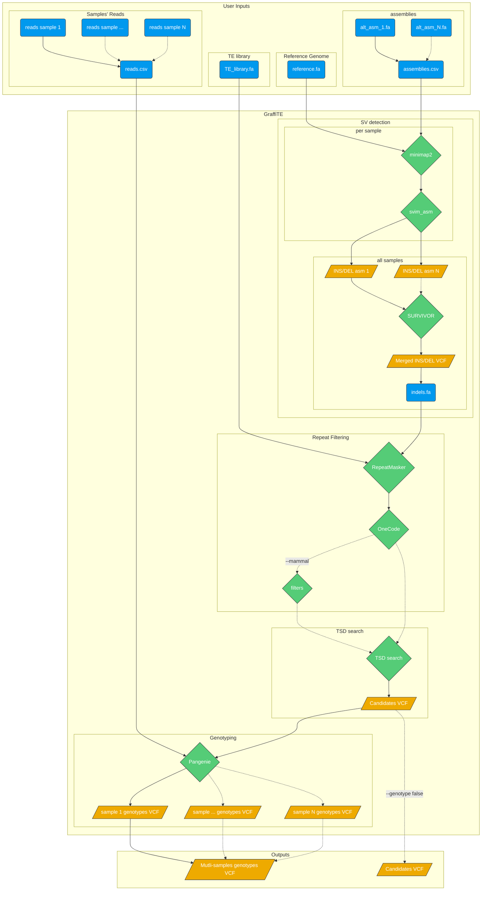

# `GraffiTE`


## Description

`GraffiTE` is a pipeline that finds polymorphic transposable elements in genome assemblies and genotypes the discovered polymorphisms in read sets using a pangenomic approach.



## Installation


### Prerequisites

`GraffiTE` is a `Nextflow` pipeline, with all the dependencies wrapped in a `Singularity` image. It is thus compatible with any Linux system including HPCs.

- install [Nextflow](https://www.nextflow.io/docs/latest/getstarted.html)
- install [Singularity](https://apptainer.org/admin-docs/master/installation.html)

### GraffiTE install

To download and run `GraffiTE`, install `nextflow` and use the following command line:

```
nextflow run cgroza/GraffiTE \
   --assemblies assemblies.csv \
   --reads reads.csv \
   --TE_library library.fa \
   --reference reference.fa
```

This will download and cache the `GraffiTE` pipeline and Singularity image for local use. Later runs will skip the slow download step.

## Running GraffiTE

### Parameters

- `--assemblies`: a CSV file that lists the genome assemblies and sample names from which polymorphisms are to be discovered. One assembly per sample and sample names must be unique.

Example `assemblies.csv`:
```
path,sample
/path/to/assembly/sampleA.fa,sampleA_name
/path/to/assembly/sampleB.fa,sampleB_name
/path/to/assembly/sampleZ.fa,sampleZ_name

```

- `--reads`: a CSV file that lists the read sets (FASTQs) and sample names from which polymorphisms are to be genotyped. These samples may be different than the genome assemblies. Only one FASTQ per sample, and sample names must be unique. Paired-end reads must be concatenated in the same file.
> Note that the current genotyper, `PanGenie` is optimized for short-reads. Long-read support will be available soon!

Example `reads.csv`:
```
path,sample
/path/to/reads/sample1.fastq,sample1_name
/path/to/reads/sample2.fastq,sample2_name
/path/to/reads/sampleN.fastq,sampleN_name

```

- `--TE_library`: a FASTA file that lists the consensus sequences of the transposable elements to be discovered. Must be compatible with `RepeatMasker`, i.e. with header in the format: `>TEname#type/subtype` for example `AluY#SINE/Alu`
   - From [DFAM](https://dfam.org/releases/current/families/) (open access): download the latest DFAM release (`Dfam.h5` or `Dfam_curatedonly.h5` files) and use the tool [FamDB](https://github.com/Dfam-consortium/FamDB) to extract the consensus for your model: `famdb.py -i <Dfam.h5> families -f fasta_name -a <taxa> --include-class-in-name > TE_library.fasta`
   - From [Repbase](https://www.girinst.org/server/RepBase/index.php) (paid subscription): use the "RepeatMasker Edition" libraries

- `--reference`: a reference genome of the species being studied. All assemblies are compared to this reference genome.

### Additional parameters


- `--out`: if you would like to change the default output directory (`out/`).
- `--genotype`: true or false. Use this if you would like to discover polymorphisms in assemblies but you would like to skip genotyping polymorphisms from reads.
- `--tsd_win`: the length in bp of flanking region (5' and 3' ends) for Target Site Duplication (TSD) search. Default 30bp. By default, 30bp upstream and downstream each variant will be added to search for TSD. (see also TSD section)
- `--cores`: global CPU parameter. Will apply the chosen integer to all multi-threaded processes.
- `--vcf`: a *fully phased* VCF file. Use this if you already have a *phased* VCF file that was produced by GraffiTE, or from a difference source and would like to use the graph genotyping step. Note that TE annotation won't be performed on this file (we will work on adding this feature), and only genotyping with Pangenie will be performed.
- `--mammal`: Apply mammal-specific annotation filters. (i) will search for LINE1 5' inversion (due to Twin Priming or similar mechanisms). Will call 5' inversion if (and only if) the variant has two RepeatMasker hits on the same L1 model (for example L1HS, L1HS) with the same hit ID, and a `C,+` strand pattern. (see Mammal filter section for more details)

#### Process-specific parameters

##### SV detection
- `--svim_asm_threads`: number of `minimap2` threads (parameter `-t` in `minimap2`). Overrides `--cores`
- `--mini_K`: `minimap2` parameter `-K`. *Number of bases loaded into memory to process in a mini-batch. Similar to option -I, K/M/G/k/m/g suffix is accepted. A large NUM helps load balancing in the multi-threading mode, at the cost of increased memory.* Default 500M
- `--svim_asm_memory`: RAM limit for the SV search (minimap2+svim_asm) process. Default is unset.
- `--stSort_m`: `samtools sort` parameter `-m` (for each alternative assembly, post-minimap2): *Approximately the maximum required memory per thread, specified either in bytes or with a K, M, or G suffix.* Default in `GraffiTE` is 4G.
- `--stSort_t`: `samtools sort` parameter `@` (for each alternative assembly, post-minimap2): *Set number of sorting and compression threads.* Default in `GraffiTE` is 4 threads. 

##### SV Annotation (RepeatMasker)
- `--repeatmasker_threads`: number of RepeatMasker threads. Overrides `--cores`
- `--repeatmasker_memory`: RAM limit for the RepeatMasker (annotation) process. Default is unset.

##### Genotyping
- `--pangenie_threads`: number of `Pangenie` threads. Overrides `--cores`
- `--pangenie_memory`: RAM limit for the Pangenie (genotyping) process. Default is unset.

### Outputs

The results of `GraffiTE` will be produced in a designated folder with the option `--out`. The output folder contains up to 4 folders (3 if `--genotype false` is set).
- `1_SV_search`: This folder will contain 1 VCF file per alternative assembly. The format is `[assembly_name].vcf` with `[assembly_name]` as set in the file `assemblies.csv`
- `2_Repeat_Filtering`:
   - `genotypes_repmasked_filtered.vcf` a vcf file with the merged variants detected in each alternative assembly. The merge is made with `SURVIVOR` with the parameters `SURVIVOR merge vcfs.txt 0.1 0 0 0 0 100`. Details about the vcf annotation can be found in the VCF section of the manual. This VCF contains only variants for witch repeats in the `--TE_library` file cover more than 80% of the sequence (can be from 1 or more repeat models).
   - `repeatmasker_dir`:
      - `indels.fa.*`: `RepeatMasker` output file. `indels.fa` represents all SV sequences queried to `RepeatMasker`. See the [RepeatMasker documentation](https://www.repeatmasker.org/webrepeatmaskerhelp.html) for more information. 
      - `ALL.onecode.elem_sorted.bak`: original `OneCodeToFindThemAll` outputs. see [here](https://mobilednajournal.biomedcentral.com/articles/10.1186/1759-8753-5-13) fore more details.
      - `OneCode_LTR.dic`: `OneCodeToFindThemAll` LTR dictionary automatically produced from `--TE_library` see [here](https://mobilednajournal.biomedcentral.com/articles/10.1186/1759-8753-5-13) fore more details.
      - `onecode.log`: log file for `OneCodeToFindThemAll` processing.
- `3_TSD_Search`
   - `pangenie.vcf` final VCF containing all retained repeat variants and annotation (with TSD if present). This file is used later by `Pangenie` to create the genome-graph onto which reads are mapped for genotyping.
   - `TSD_summary.txt`: tab delimited output of the TSD search module. 1 line per variant. See TSD section for more information. "PASS" entries are reported in the `pangenie.vcf` and final (with genotypeS) VCF.
   ```
   SV_name                          RM_family_name    RM_hit_strand  RM_hit_divergence TSD_length
   HG002_mat.svim_asm.DEL.1014      AluY              C              2.2               10      0       0       -1      0       1       0       ATTATTATTA      ATTATTATTA      PASS
   HG002_mat.svim_asm.DEL.1013      L1HS              C              1.3               16      0       0       -15     3       1       0       AGTATTCTGGATTTTT        AGTATTCTGGATTTTT    FAIL
   G002_mat.svim_asm.DEL.1015       L1HS              +              1.0738            4       0       0       -9      0       1       0       AAAG    AAAG    FAIL
   HG002_mat.svim_asm.DEL.102       AluYa5            C              0.3               11      0       0       -1      0       1       0       CTGCATACTTT     CTGCATACTTT     PASS
   HG002_mat.svim_asm.DEL.1011      L1P2              C              6.9               4       0       0       -21     0       1       0       CATC    CATC    FAIL
   HG002_mat.svim_asm.DEL.1005      AluY              C              1.0               12      0       0       -1      0       1       0       CCAGAAGTCTTT    CCAGAAGTCTTT    PASS
   HG002_mat.svim_asm.DEL.1010      AluYh3            +              2.4               12      0       0       -1      0       1       0       AATTTCTATCTC    AATTTCTATCTC    PASS
   ```
   - `TSD_full_log.txt:`detailed (verbose rich) report of TSD search for each SV.
   ```
      --- TSD search for HG002_mat.svim_asm.DEL.1014 ---

   >L|5P_end
   ACAGGCGTGAGCCTCCACGCCTGGCCTAGATATTATTATTATTATTATTA
   ||||||||||||||||||||||||||||||||||||||||||||||||||
   1   5    10   15   20   25   30   35   40   45   50
   >R|3P_end
   ATTATTATTAACCTATTTTACAGATGAGGG
   ||||||||||||||||||||||||||||||||||||||||||||||||||
   1   5    10   15   20   25   30   35   40   45   50

   3' poly_A: element is in C orientation, will not search for poly_A
   5' poly_T: 0 bp, will not remove anything for alignment


   Building a new DB, current time: 11/02/2022 22:27:12
   New DB name:   /scratch/cgoubert/GraffiTE/work/d1/3d8805a29e13fad52ed5aa1e7a9e76/L.short.fasta
   New DB title:  L.short.fasta
   Sequence type: Nucleotide
   Keep MBits: T
   Maximum file size: 1000000000B
   Adding sequences from FASTA; added 1 sequences in 0.000507116 seconds.

   candidate hits from blastn:
   R|3P_end        L|5P_end        100.000 10      0       0       1       10      41      50      0.001   19.6
   R|3P_end        L|5P_end        100.000 4       0       0       1       4       47      50      3.1      8.5
   R|3P_end        L|5P_end        100.000 10      0       0       1       10      38      47      0.001   19.6
   R|3P_end        L|5P_end        100.000 10      0       0       1       10      35      44      0.001   19.6
   R|3P_end        L|5P_end        100.000 10      0       0       1       10      32      41      0.001   19.6
   R|3P_end        L|5P_end        100.000 8       0       0       3       10      31      38      0.018   15.9
   R|3P_end        L|5P_end        100.000 4       0       0       12      15      25      28      3.1      8.5
   R|3P_end        L|5P_end        87.500  8       0       1       14      20      37      44      3.1      8.5
   R|3P_end        L|5P_end        87.500  8       0       1       14      20      31      38      3.1      8.5
   R|3P_end        L|5P_end        100.000 4       0       0       20      23      1       4       3.1      8.5
   R|3P_end        L|5P_end        100.000 4       0       0       22      25      28      31      3.1      8.5
   R|3P_end        L|5P_end        100.000 4       0       0       25      28      8       11      3.1      8.5

   candidate TSDs:
   ACAGGCGTGAGCCTCCACGCCTGGCCTAGATATTATTATTATTATTATTA[ <<< AluY C <<< ]ATTATTATTAACCTATTTTACAGATGAGGG


   PASS

   3' end: nothing to extend
   5' end: nothing to extend
   SVname  TEname  Strand  Div     AlnLen  MM      Gaps    5P_TSD_end      5P_offset       3P_TSD_start    3P_offset       5P_TSD  3P_TSD
   HG002_mat.svim_asm.DEL.1014     AluY    C       2.2     10      0       0       -1      0       1       0       ATTATTATTA      ATTATTATTA      PASS
   ```

- `4_Genotyping`

```
OUTPUT_FOLDER/
├── 1_SV_search
│   ├── HG002_mat.vcf
│   └── HG002_pat.vcf
├── 2_Repeat_Filtering
│   ├── genotypes_repmasked_filtered.vcf
│   └── repeatmasker_dir
│       ├── ALL.onecode.elem_sorted.bak
│       ├── indels.fa.cat.gz
│       ├── indels.fa.masked
│       ├── indels.fa.onecode.out
│       ├── indels.fa.out
│       ├── indels.fa.out.length
│       ├── indels.fa.out.log.txt
│       ├── indels.fa.tbl
│       ├── onecode.log
│       └── OneCode_LTR.dic
├── 3_TSD_search
│   ├── pangenie.vcf
│   ├── TSD_full_log.txt
│   └── TSD_summary.txt
└── 4_Genotyping
    ├── GraffiTE.merged.genotypes.vcf
    ├── HG002_s1_10X_genotyping.vcf.gz
    ├── HG002_s1_10X_genotyping.vcf.gz.tbi
    ├── HG002_s2_10X_genotyping.vcf.gz
    └── HG002_s2_10X_genotyping.vcf.gz.tbi
```

### Execution profiles
By default, the pipeline will inherit the your `nextflow` configuration and run accordingly.
To execute locally, on SLURM, or AWS, pass one of the `-profile` provided with the `GraffiTE`:
- `standard`
- `cluster`
- `cloud`

For example,
```
nextflow run cgroza/GraffiTE -profile cluster ...
```
will run on SLURM.

## Changing the number of CPUs and memory required by each step
You may alter the following parameters on the command line or in your own `nextflow` configuration file to change how many CPUs and how much memory will be required by each step.

- Step 1, polymorphisms discovery. The memory requirement depends on the genome size of the species. More cores is faster.
```
params.svim_asm_memory
params.svim_asm_threads
```

- Step 2, merging polymorphisms. The requirements depends on the number of assemblies.
```
params.make_vcf_memory
params.make_vcf_threads
```
- Step 3, genotyping polymorphisms from reads. The memory requirements depend on the genome size and size of the read sets. More cores is faster.
```
params.pangenie_memory
params.pangenie_threads
```

The requirements are numbers or strings accepted by `nextflow`. For example, 40 for number of CPUs and '100G' for memory.
