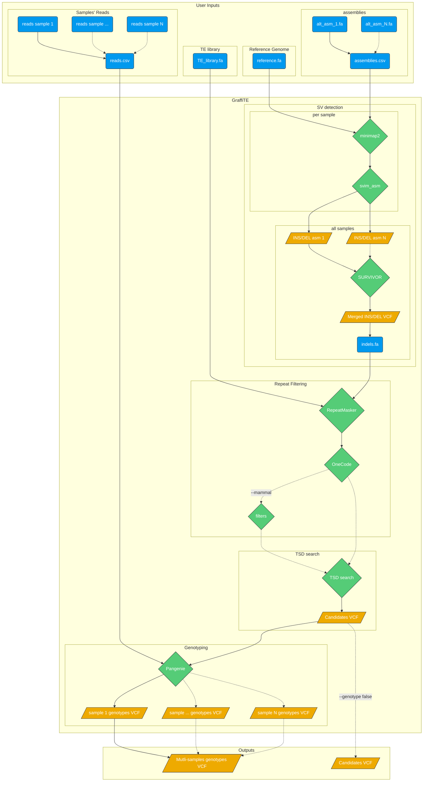

```mermaid
graph TD;
    I1 --> P1;
    I2 --> P1;
    P1 --> P2;
    P2 --> F1.1;
    P2 --> F1.2
    F1 --> F2;
    F2 --> P3;
    I3 --> P3;
    P3 --> P4;
    P4 -."--mammal".->P5;
    P5 -.-> P6;
    P4 -.-> P6;
    P6 --> F3;
    F3 --> P7;
    I4 --> P7;
    subgraph User Inputs;
        subgraph Reference Genome
            I1(reference.fa):::data;
        end
        subgraph assemblies;
            I2(assemblies.csv):::data;
            A1(alt_asm_1.fa):::data-->I2
            A2(alt_asm_N.fa):::data-.->I2
        end
        subgraph TE library;
            I3(TE_library.fa):::data;
        end
        subgraph Samples' Reads;
            I4(reads.csv):::data;
            R1(reads sample 1):::data-->I4
            R2(reads sample ...):::data-.->I4
            R3(reads sample N):::data-.->I4
        end
    end
    subgraph GraffiTE;
     subgraph SV detection;
        subgraph per sample;
        P1{minimap2}:::script;
        P2{svim_asm}:::script;
        end
        subgraph all samples;
        F1.1[/INS/DEL asm 1/]:::VCF-->P2.2
        F1.2[/INS/DEL asm N/]:::VCF-.->P2.2
        P2.2{SURVIVOR}:::script
        F2(indels.fa):::data;
        P2.2-->F1[/Merged INS/DEL VCF/]:::VCF;
        end
     end
        subgraph Repeat Filtering;
        P3{RepeatMasker}:::script;
        P4{OneCode}:::script;
        P5{filters}:::script;
        end
        subgraph TSD search;
        P6{TSD search}:::script
        F3[/Candidates VCF/]:::VCF
        end
        subgraph Genotyping
        P7{Pangenie}:::script-->O1.1[/sample 1 genotypes VCF/]:::VCF        
        P7{Pangenie}:::script-.->O1.2[/sample ... genotypes VCF/]:::VCF
        P7{Pangenie}:::script-.->O1.3[/sample N genotypes VCF/]:::VCF
        end
    end
    subgraph Outputs;
    O1.1-->O1[/Mutli-samples genotypes VCF/]:::VCF
    O1.2-.->O1[/Mutli-samples genotypes VCF/]:::VCF
    O1.3-.->O1[/Mutli-samples genotypes VCF/]:::VCF
    F3-."--genotype false".->F3.1[/Candidates VCF/]:::VCF
    end
classDef data fill:#09E,stroke:#333,color:#FFF;
classDef script fill:#5C7,stroke:#333,stroke-width:1px,color:#FFF;
classDef VCF fill:#EA0,stroke:#333,stroke-width:1px,color:#FFF
```