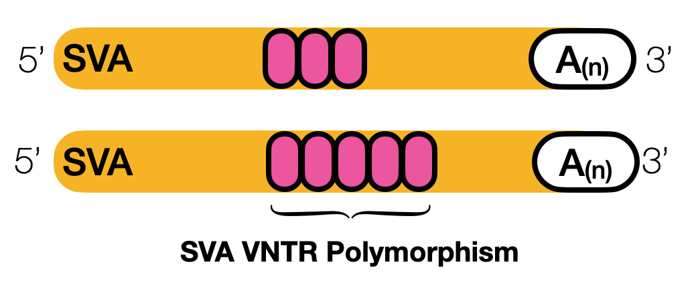

# SVA VNTR polymorphisms

!!! info "Applies to GraffiTE v1.1"
    Verified against `v1.1dev` at commit `4c8e385`. The
    [2024 paper](https://www.nature.com/articles/s41467-024-53294-2) describes v1.0, which
    differs in places; see [v1.0 vs v1.1](../getting-started/v1.0-vs-v1.1.md).

## SVA structure

An SVA element is a composite: a hexamer repeat at the 5' end, an *Alu*-like region, a
variable number of tandem repeats (the VNTR), a SINE-R region derived from an endogenous
retrovirus, and a polyA tail. The VNTR is made of GC-rich units of roughly 37 to 50 bp, and its
copy number varies between elements and between alleles of the same element.

<figure markdown="span">

<figcaption>The regions of an SVA element. The VNTR is the part that expands and contracts.</figcaption>
</figure>

## VNTR-only polymorphisms

Because the VNTR is a tandem array, it changes length by replication slippage or unequal
recombination without any transposition. Between two haplotypes that both carry the same SVA,
one can have a longer VNTR than the other, and an SV caller reports that difference as an
insertion or a deletion of a few hundred bp. RepeatMasker then annotates the variant sequence
as SVA, since VNTR sequence is SVA sequence, and without a rule to catch it the variant counts as
an SVA insertion polymorphism when no element moved.

GraffiTE recognises these by where the hit lands on the consensus: a variant whose single SVA
fragment sits entirely inside the VNTR region of its subfamily is a VNTR-only polymorphism.

## VNTR coordinates by subfamily

The VNTR interval on each subfamily consensus, as fixed in `annotate_vcf.R`:

| Subfamily | VNTR start | VNTR end |
|---|---|---|
| `SVA_A` | 436 | 855 |
| `SVA_B` | 431 | 867 |
| `SVA_C` | 432 | 851 |
| `SVA_D` | 432 | 689 |
| `SVA_E` | 428 | 864 |
| `SVA_F` | 435 | 857 |

<span class="src">`bin/annotate_vcf.R:108-110`</span>

The coordinates are those of the Dfam human consensus sequences with those names, so the rule
only fires for a library that uses them. A hit named otherwise (`SVA_F1`, or a species-specific
name) is left as is.

## How GraffiTE reclassifies them

A hit is a VNTR-only polymorphism when all of these hold:
<span class="src">`bin/annotate_vcf.R:112-125`</span>

- its class is `Retroposon/SVA`;
- it is a single RepeatMasker fragment;
- its name is one of the six subfamilies above;
- its start on the consensus is greater than the subfamily's VNTR start, and its end is less
  than the VNTR end (strictly inside on both sides).

Such a hit is then written with a `(VNTR_only)` suffix on its name in `repeat_ids`, and its
entry in `matching_classes` becomes `Simple_repeat` instead of `Retroposon/SVA`. The hit is
still counted in `n_hits` and still contributes to `total_repeat_span`.
<span class="src">`bin/annotate_vcf.R:127-132`</span>

```text
repeat_ids=SVA_F(VNTR_only);matching_classes=Simple_repeat
```

That relabelling is what the downstream filters see:

- The **trusted subset** admits a `Simple_repeat` record without testing its `ULTRA_TR_span`,
  so a VNTR expansion (which is all tandem repeat) is not excluded on that ground.
  <span class="src">`module/main.nf:482`</span>
- The **`--human` filter** admits `Simple_repeat` records whose `repeat_ids` match
  `--human_sva_ids` (default `^SVA_[DEF]`), without requiring a polyA tail, so VNTR
  polymorphisms of the young subfamilies are kept in `pangenome.human.vcf`, distinguishable
  from SVA insertions by the suffix.
  <span class="src">`module/main.nf:496,498,504`, `nextflow.config:67`</span>

To count SVA insertion polymorphisms alone, exclude them:

```bash
bcftools view -e 'INFO/repeat_ids~"VNTR_only"' pangenome.human.vcf
```

In v1.0 the same records were flagged with `mam_filter_2=VNTR_ONLY:<family>:<start>:<end>`,
only with `--mammal`, and kept their `Retroposon/SVA` class.
