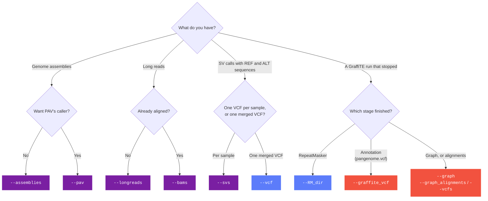

# Choosing your inputs

!!! info "Applies to GraffiTE v1.1"
    Verified against `v1.1dev` at commit `4c8e385`. The
    [2024 paper](https://www.nature.com/articles/s41467-024-53294-2) describes v1.0, which
    differs in places; see [v1.0 vs v1.1](v1.0-vs-v1.1.md).

GraffiTE is three stages in series, and every input flag is a way of entering that series at a
given point. Choose the flag by asking what you already have.

---

## The three stages

| Stage | Question it answers | Enters with | Produces |
|---|---|---|---|
| **A, discovery** | Where do the sequence-resolved insertions and deletions sit relative to the reference? | `--assemblies`, `--pav`, `--longreads`, `--bams`, `--svs` | `1_SV_search/SVs.vcf` |
| **B, annotation** | Which of those SVs are transposable elements, and what are they? | `--vcf`, `--RM_dir` | `3_TSD_search/pangenome.vcf` and its subsets |
| **C, genotyping** | Which samples carry each polymorphism? | `--graffite_vcf`, `--graph`, `--graph_alignments`, `--vcfs` | `4_Genotyping/GraffiTE.merged.genotypes.vcf.gz` |

A fourth, optional step lifts methylation onto the graph (`--epigenomes`), only on the
`giraffe` and `graphaligner` methods <span class="src">`main.nf:245`</span>. See
[Methylation](../guides/methylation.md).

---

## What data do you have?



Every discovery input needs `--reference` and `--TE_library`. Genotyping needs `--genotype_with`
unless you pass `--genotype false`.

---

## What each flag runs and skips

| Flag | Takes | Runs | Skips |
|---|---|---|---|
| `--assemblies` | CSV `sample,path` of haploid assemblies | minimap2, svim-asm, then B and C | nothing |
| `--pav` | CSV without header, `sample,hap1[,hap2...]` | PAV in its own container, then B and C | nothing |
| `--longreads` | CSV `sample,path,type` | minimap2 or winnowmap, Sniffles2, then B and C | nothing |
| `--bams` | CSV `sample,path` of long-read alignments | Sniffles2, then B and C | read alignment |
| `--svs` | CSV `sample,path` of per-sample VCFs | the truvari merge, then B and C | all callers |
| `--vcf` | one sequence-resolved VCF | B and C | the callers and the truvari collapse |
| `--RM_dir` | a `2_Repeat_Filtering` directory | TSD search onwards, then C | A and RepeatMasker |
| `--graffite_vcf` | a `pangenome.vcf` | C only | A and B |
| `--graph` | a `GraffiTE_graph/index` directory | read alignment and calling | graph construction |
| `--graph_alignments` | CSV `sample,gaf,pack` | `vg call` and the merge | graph alignment |
| `--vcfs` | CSV `sample,path` of per-sample `vg call` VCFs | the merge | alignment and calling |
| `--hervk_reconcile_vcf` | a genotyped VCF from an earlier run, with `--human --genotype false` | A, B, then HERV-K consolidation against that VCF | C |
| `--genotype false` | | A and B | C |

Lines in `main.nf`: the discovery block <span class="src">`main.nf:76-126`</span>, the
annotation entry points <span class="src">`main.nf:129-156`</span>, `--graffite_vcf`
<span class="src">`main.nf:183-186`</span>, the genotyping block
<span class="src">`main.nf:188-290`</span>. Samplesheet columns are on
[Samplesheet formats](../reference/samplesheets.md).

---

## Combining flags

**Discovery flags add up.** `--assemblies`, `--pav`, `--longreads`, `--bams` and `--svs` can be
passed together in any combination; every caller's output goes into one truvari merge
<span class="src">`main.nf:125`</span>. This is how the paper's `GT-svsn` mode is run.

**`--vcf` stands alone.** It replaces the merge, so pairing it with a discovery flag is refused
before anything runs:

```
--vcf cannot be combined with --assemblies. Pass --vcf alone, or drop it and use --svs to add your own per-sample VCFs to the discovery merge.
```

<span class="src">`main.nf:54-57`</span>.

**`--graffite_vcf` skips the HERV-K annotation.** With `--human`, the consolidation step needs
files that only discovery writes, so `--graffite_vcf --human` needs `--hervk_reconcile false`,
or start from `--RM_dir` instead <span class="src">`main.nf:69-71`</span>.

**`--graph_method precomputed` needs its inputs.** It builds nothing, so it requires `--graph`
and one of `--vcfs` or `--graph_alignments` <span class="src">`main.nf:61-64`</span>.

**`-resume`** is Nextflow's own restart and covers the common case of a crashed run; the entry
flags are for runs whose work directory is gone. See [Resuming and skipping work](../guides/skipping-work.md).

---

## Where to read next

- [Stage A: discovery](../guides/discovery.md) for the callers and the merge.
- [Stage B: repeat annotation](../guides/annotation.md) for RepeatMasker, ULTRA, TSDs and the filters.
- [Stage C: genotyping](../guides/genotyping.md) for PanGenie, Giraffe and GraphAligner.
- [Parameters](../reference/parameters.md) for every flag and its default.
