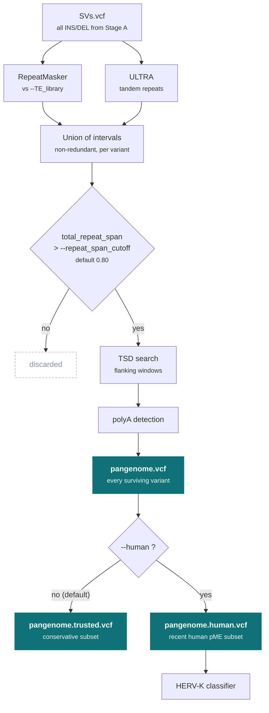

# Stage B: repeat annotation

!!! info "Applies to GraffiTE v1.1"
    Verified against `v1.1dev` at commit `4c8e385`. The
    [2024 paper](https://www.nature.com/articles/s41467-024-53294-2) describes v1.0, which
    differs in places; see [v1.0 vs v1.1](../getting-started/v1.0-vs-v1.1.md).

Stage B takes the merged SV set from [Stage A](discovery.md) (or the VCF you gave it) and answers
two questions about each variant: is its sequence mostly repeat, and if so, what repeat. Variants
that fail the first question are discarded. The rest come out as `pangenome.vcf` with the
annotation fields described in [VCF fields](../reference/vcf-fields.md), plus a filtered subset.

## What Stage B does



!!! important "`--human` replaces the trusted subset"
    With `--human`, `pangenome.trusted.vcf` and `pangenome.presence-absence_trusted.tsv` are not
    written at all. The human filter is applied to `pangenome.vcf` directly, not on top of the
    trusted subset. This changed in v1.1; earlier versions produced
    `pangenome.trusted.human.vcf` as a subset of the trusted set.
    <span class="src">`module/main.nf:551-562`</span>

## The TE library

`--TE_library` is a FASTA of repeat consensus sequences passed to RepeatMasker as `-lib`. It is
the only thing that decides what a variant is called, so the names and classes in it are the
names and classes you get back in `repeat_ids` and `matching_classes`. Two things in it matter
to the annotation:

- **The class in the header.** RepeatMasker reads `#class/family` after the name
  (`AluYa5#SINE/Alu`, `L1HS#LINE/L1`, `LTR5_Hs#LTR/ERVK`). That string is `matching_classes`. The
  filters test it literally, so a library that says `SINE/Alu` works with `--human` and one that
  says `Alu` does not. Sequences whose class is `Simple_repeat` or `Low_complexity` are ignored
  by the annotation, and do not count toward the TE span.
  <span class="src">`bin/annotate_vcf.R:74`, `bin/repmask_vcf.sh:61`</span>
- **The names.** `--human` matches its whitelists against `repeat_ids` with anchored prefixes
  (`^AluY`, `^L1HS`, `^SVA_[DEF]`, `^HERVK-int`), and the L1 and SVA rules key on the classes
  `LINE/L1` and `Retroposon/SVA` and on the subfamily names `SVA_A` to `SVA_F`. A library with
  other conventions still annotates, but those rules will not fire.
  <span class="src">`nextflow.config:65-76`, `bin/annotate_vcf.R:95,108-116`</span>

The Dfam human library the test set ships (`human_DFAM3.6.fasta`) follows these conventions. For
another species, a RepeatModeler or Dfam library in RepeatMasker format is what the pipeline
expects; see [Choosing your inputs](../getting-started/choosing-your-inputs.md).

## RepeatMasker and ULTRA

`repeatmask_VCF` runs once per contig of the merged VCF. It writes every variant's inserted
sequence (the ALT of an insertion, the REF of a deletion) to `indels.fa`, named by variant ID, and
runs two tools on that file.
<span class="src">`bin/repmask_vcf.sh:9-10`</span>

**RepeatMasker**, in sensitive mode against your library, with a quarter of the task's cores as
parallel jobs (RepeatMasker uses four threads per job):
<span class="src">`bin/repmask_vcf.sh:22-30`</span>

```bash
RepeatMasker -lib ${TE_library} -s -dir repeatmasker_dir -pa $(( $(nproc) / 4 )) indels.fa
```

v1.0 passed `-nolow` here. It was removed on 2025-01-01 because it produced spurious
low-complexity hits; simple repeats are still masked, then set aside by the annotation.

**ULTRA**, on every core, to find tandem repeats whether or not RepeatMasker called them
something:
<span class="src">`bin/repmask_vcf.sh:39`</span>

```bash
ultra --bed -t $(nproc) -o ultra_temp/ultra_out indels.fa
```

RepeatMasker's `.out` table is then parsed by `annotate_vcf.R`. Fragments that share a
RepeatMasker link ID are grouped into one **hit**, named after the highest-scoring fragment;
that is where `n_hits`, `fragmts`, `repeat_ids`, `matching_classes`, `RM_hit_strands` and
`RM_hit_IDs` come from. v1.0 used OneCodeToFindThemAll for this grouping; v1.1 reads the `.out`
file directly.
<span class="src">`bin/repmask_vcf.sh:55`, `bin/annotate_vcf.R:73-90`</span>

Two rules run on the grouped hits before they are written out: the L1 twin-priming signature that
sets `L1_5PINV`, and the SVA VNTR rule that renames a hit lying inside the VNTR and moves it to
`Simple_repeat`. Both are described on their own pages,
[L1 5' inversions](../background/l1-5prime-inversion.md) and
[SVA VNTR polymorphisms](../background/sva-vntr.md).

## The repeat-span filter

Each variant gets one number, `total_repeat_span`: the fraction of its sequence covered by the
union of RepeatMasker TE intervals (simple repeats and low complexity excluded) and ULTRA
tandem-repeat intervals, overlaps counted once, capped at 1.
<span class="src">`bin/repmask_vcf.sh:86-94`</span>

A variant is kept when `total_repeat_span` is strictly greater than `--repeat_span_cutoff`
(default `0.80`, a fraction of the variant length). The test is applied twice with the same
cutoff: once per contig, which produces `genotypes_repmasked_filtered.vcf`, and once more when
the contigs are concatenated.
<span class="src">`module/main.nf:615`, `module/main.nf:533`, `nextflow.config:56`</span>

Two consequences of using the union rather than the TE span alone. A variant that is a
polyA-rich Alu with a long tandem stretch passes, because ULTRA covers what RepeatMasker did not.
And a variant that is nothing but a tandem repeat also passes the span filter, with `n_hits=0`;
it is the trusted and human subsets, downstream, that require a TE hit.

`total_match_span`, the v1.0 metric (TE intervals only, no ULTRA), is still written but no longer
tested.

## Target site duplications

For every variant that passed the filter, GraffiTE takes `--tsd_win` bp (default 30) of reference
on each side of the breakpoint and the same width from each end of the variant sequence, and
looks for an exact duplication of 4 to 20 bp that sits close to the junctions. A duplication that
passes is written as `INFO/TSD`, as its two copies. The search runs on every variant, whatever
its `n_hits`. The procedure, the scoring and the log format are in
[Target site duplications](../background/tsd.md).
<span class="src">`module/main.nf:619-664`, `nextflow.config:49`</span>

## polyA annotation

`add_polyA.py` runs on the concatenated VCF after the reference alleles have been re-read. For a
variant with exactly one hit it scans the 3' end of the variant sequence for an A-rich tail when
the hit is on the `+` strand, or the 5' end for a T-rich tail when it is on `C`, after trimming
the matching copy of `TSD` from that end. A tail is called when a window of at least 8 bp with at
least 80% A (or T) ends within 5 bp of the trimmed terminus. The result is `polyA=TRUE` or
`FALSE`; a variant with more than one hit gets `NA` and is not scanned. The three constants are
fixed in the script.
<span class="src">`bin/add_polyA.py:21-23,100-118`, `module/main.nf:543`</span>

## The trusted subset

Without `--human`, `concat_repeatmask` also writes `pangenome.trusted.vcf`, the records that pass
this `bcftools view -i` expression, with the defaults filled in:
<span class="src">`module/main.nf:482-483,554`</span>

```text
n_hits==1
& abs(SVLEN)>=250
& (ULTRA_TR_span<0.6 | matching_classes="Simple_repeat")
& ((matching_classes!~"LINE" & matching_classes!~"SINE" & matching_classes!~"Retroposon") | polyA="TRUE")
& FILTER="PASS"
```

Read as four criteria:

| Criterion | Parameter | Default |
|---|---|---|
| One RepeatMasker hit, so the variant is one element and not a nested or composite one. | none | |
| Long enough to be a full-length element rather than a fragment. | `--trusted_min_svlen` | `250` bp |
| Not dominated by tandem repeat, unless RepeatMasker itself called it a simple repeat (the SVA VNTR case). | `--trusted_max_ultra_span` | `0.6` (fraction of variant length) |
| If it is a non-LTR element (LINE, SINE, SVA), it has a polyA tail. | none | |

The `FILTER="PASS"` clause is dropped with `--trusted_ignore_filter`, for callers that leave
`FILTER` empty.
<span class="src">`nextflow.config:57-59`</span>

!!! warning "The negated class test is weaker than it looks"
    `matching_classes!~"SINE"` is true for every record in bcftools, `SINE/Alu` ones included,
    because `!~` does not negate reliably on `Number=.` fields. In practice the expression
    requires `polyA="TRUE"` only when the clause with the negations is false, which it never
    is, so the trusted subset does **not** require a polyA tail of non-LTR elements. The
    `--human` filter is written with positive matches to avoid this. See
    [VCF fields](../reference/vcf-fields.md) for the bcftools behaviour.
    <span class="src">`module/main.nf:499-503`</span>

For human data, `--human` replaces this subset with a filter on recent subfamilies; see
[Human MEIs](human-mei.md).

## Parallelism and batching

Stage B parallelises twice.

- **By contig.** `split_repeatmask` writes one VCF per contig of the merged set and
  `repeatmask_VCF` runs on each, with the `repeatmasker_*` resource parameters. A genome with
  thousands of small scaffolds spawns thousands of tasks; `--cores` and
  `--repeatmasker_threads` set what each gets. RepeatMasker's own `-pa` is a quarter of that.
  <span class="src">`module/main.nf:447-460`, `nextflow.config:215-219`</span>
- **By batch of variants for the TSD search.** Each contig's variant list is split into batches
  of `--tsd_batch_size` (default 100 variants) and `tsd_search` runs on each batch with the
  `tsd_*` parameters, so a contig with 5,000 variants is 50 tasks. The batches are gathered
  back per contig by `tsd_report`.
  <span class="src">`main.nf:157-162`, `nextflow.config:55`</span>

`concat_repeatmask` then joins every contig into `pangenome.vcf`. Everything in this stage is
recoverable with `-resume`, and a finished Stage B can be re-entered with `--RM_dir` or
`--graffite_vcf`; see [Resuming and skipping work](skipping-work.md).
