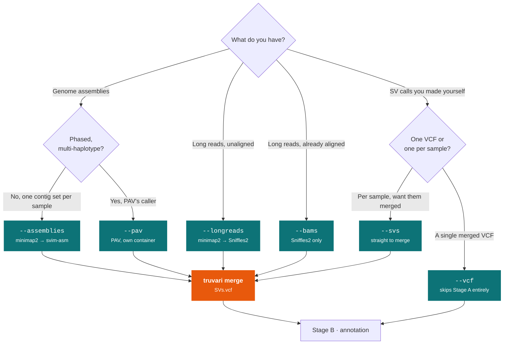

# Stage A: discovery

!!! info "Applies to GraffiTE v1.1"
    Verified against `v1.1dev` at commit `4c8e385`. The
    [2024 paper](https://www.nature.com/articles/s41467-024-53294-2) describes v1.0, which
    differs in places; see [v1.0 vs v1.1](../getting-started/v1.0-vs-v1.1.md).

Stage A turns your input data into **one non-redundant set of insertion and deletion calls relative
to the reference genome**. Everything downstream operates on that set.

Four backends can produce those calls, plus two ways to supply calls you already have. They are
**additive**: pass several and all of their output is merged in a single run.

---

## Which entry point do you want?



!!! warning "`--vcf` is not additive"
    Every other entry point above can be combined freely. `--vcf` cannot: it bypasses Stage A, so
    the workflow refuses it beside any discovery flag before anything runs
    <span class="src">`main.nf:54-57`</span>:

    ```text
    --vcf cannot be combined with --assemblies. Pass --vcf alone, or drop it and use --svs
    to add your own per-sample VCFs to the discovery merge.
    ```

    If you want your own VCF *merged with* other discovery output, use `--svs` instead.

The samplesheets below are examples. The column each flag reads, and what happens to a column it
does not read, are in [Samplesheets](../reference/samplesheets.md).

---

## From assemblies: `--assemblies`

The most common entry point, and the one the pipeline was designed around.

**Samplesheet** (`sample,path`; column order is irrelevant, the header is what matters):

```csv title="assemblies.csv"
path,sample
/data/HG002.mat.fa.gz,HG002_mat
/data/HG002.pat.fa.gz,HG002_pat
```

Each row is treated as one haploid assembly. For a diploid sample, give each haplotype its own row
and its own sample name.

**What runs:**

1. *(optional)* `break_scaffold`: if `--break_scaffolds` is set, scaffolds are split into contigs
   at runs of `N` with `breakgaps.py`. Use this when your input is scaffolded rather than a contig
   assembly. <span class="src">`module/main.nf:1-14`</span>
2. `map_asm`: aligns to the reference with `minimap2 -a -x asm5 --cs -r2k -K 500M`, piped into
   `samtools sort -m 4G -@ 4`. The `-x` preset is `--asm_divergence`; raise it to `asm10` or
   `asm20` for assemblies more divergent from the reference. `-K` is `--mini_K`, and the sort
   memory and threads are `--stSort_m` and `--stSort_t`. With `--aligner winnowmap`, winnowmap is
   used instead, with a `meryl` k=19 repetitive-kmer set built at `distinct=0.9998`.
   <span class="src">`module/main.nf:24-37`</span>
3. `svim_asm`: `svim-asm haploid --min_sv_size 100 --types INS,DEL`. **Only insertions and
   deletions of at least 100 bp are kept**; inversions, duplications and translocations are
   discarded here and never reach the rest of the pipeline. Variant IDs are prefixed with the
   sample name. <span class="src">`module/main.nf:153-154`</span>

**Published:** `out/1_SV_search/svim-asm_individual_VCFs/<sample>.vcf.gz`

---

## From assemblies with PAV: `--pav`

An alternative assembly-based caller that takes all haplotypes of a sample together, rather than
one haploid assembly at a time. Runs in its own container
(`library://becklab/pav/pav:latest`), not the GraffiTE image.

!!! note "Positional samplesheet"
    Unlike every other GraffiTE samplesheet, the `--pav` sheet is parsed **positionally**. The
    first line is skipped as a header regardless of what it says; column 1 is the sample name and
    every remaining column is a haplotype FASTA. Column *names* are ignored.

```csv title="pav.csv"
sample,hap1,hap2
HG002,/data/HG002.hap1.fa.gz,/data/HG002.hap2.fa.gz
HG005,/data/HG005.hap1.fa.gz,/data/HG005.hap2.fa.gz
```

**What runs:** `pav_asm` writes a `config.json` and a tab-delimited `assemblies.tsv` with
`NAME`/`HAP1`…`HAPn` columns, invokes PAV's own run script, then filters to
\|SVLEN\| > 50 bp. <span class="src">`module/main.nf:116-137`</span>

**Published:** `out/1_SV_search/pav_individual_VCFs/sv_<sample>.vcf.gz`

**Resources:** `pav_asm` defaults to **32 CPUs, 120 GB and 12 h**, considerably more than any
other process. Only `--cores` overrides the CPU count; there is no `--pav_threads`.
<span class="src">`nextflow.config:321-326`</span>

---

## From long reads: `--longreads`

**Samplesheet** (`sample,path,type`):

```csv title="longreads.csv"
path,sample,type
/data/HG002.hifi.fq.gz,HG002,hifi
/data/HG005.ont.fq.gz,HG005,ont
```

The `type` column becomes the minimap2 preset as `map-<type>`, so `pb`, `ont` and `hifi` give
`map-pb`, `map-ont` and `map-hifi`. The one special case is `lr:hq`, which is passed through
unchanged rather than being prefixed.

!!! warning "`type` is not validated"
    Anything you write is pasted into the preset string. A typo like `hifi ` or `HiFi` produces
    `map-hifi ` / `map-HiFi` and minimap2 fails with an unhelpful error. Use exactly `pb`, `ont`,
    `hifi` or `lr:hq`.

**What runs:**

1. `map_longreads`: `minimap2 -ax <preset>` into `samtools sort`. With `--aligner winnowmap`,
   winnowmap with a `meryl` k=15 set. <span class="src">`module/main.nf:48-67`</span>
2. `sniffles_sample_call`: per sample, `sniffles --minsvlen 100`, producing both a `.vcf` and a
   `.snf`. <span class="src">`module/main.nf:80-81`</span>
3. `sniffles_population_call`: the `.snf` files from **all** samples are called jointly, then
   filtered to `SVTYPE` of `INS` or `DEL`, symbolic `<INS>`/`<DEL>` alleles are dropped, and the
   result is split back into one VCF per sample with `bcftools +split`.
   <span class="src">`module/main.nf:96-101`</span>

**Published:** `out/1_SV_search/sniffles2_individual_VCFs/*.vcf.gz`

---

## From aligned BAMs: `--bams`

Identical to `--longreads` from step 2 onward. It skips the alignment.

```csv title="bams.csv"
path,sample
/data/HG002.sorted.bam,HG002
```

No `type` column: the preset only mattered for alignment, which has already happened.

`--bams` and `--longreads` can be used together; both feed the same joint Sniffles2 call.

---

## From existing SV calls: `--svs`

For calls you produced yourself, per sample, that you want merged with everything else.

```csv title="svs.csv"
path,sample
/data/HG002.manta.vcf.gz,HG002
/data/HG005.manta.vcf.gz,HG005
```

No process runs: the VCFs go straight into the merge. GraffiTE does not re-filter them by size or
type, so **filter to `INS`/`DEL` yourself** if your caller emits other SV classes; anything else
will be carried into Stage B and annotated as if it were an indel.

---

## From a single merged VCF: `--vcf`

Skips Stage A. The VCF is passed through `truvari_merge` in pass-through mode (no collapsing, IDs
preserved) and goes directly to annotation. This is the "use GraffiTE purely as a TE annotator"
entry point.

```bash
nextflow run cgroza/GraffiTE -r v1.1dev -latest \
  --reference ref.fa --TE_library TEs.fa \
  --vcf my_svs.vcf.gz --genotype false
```

---

## The merge

Whatever the sources, all calls converge on `truvari_merge`, which behaves in one of three ways:

| Situation | Behaviour | Source |
|---|---|---|
| `--vcf` was used | Pass-through. Decompress only; original IDs preserved. | <span class="src">`module/main.nf:171-178`</span> |
| Exactly one VCF reached the merge | No collapse. Original IDs preserved. | <span class="src">`module/main.nf:186-189`</span> |
| Two or more VCFs | Full merge and collapse, described below. | <span class="src">`module/main.nf:192-232`</span> |

For the multi-sample case:

1. `bcftools annotate -x INFO` strips caller-specific INFO from each input, then `bcftools merge -m none`
   combines them.
2. `truvari divide` shards the merged VCF, and `truvari collapse --chain -P 0.5 -p 0.5 -S -1 -k common`
   runs **in parallel across `task.cpus` shards**. `-P 0.5` is truvari's size-similarity
   threshold and `-p 0.5` its sequence-similarity threshold, so two calls collapse when their
   lengths are within 50 % of each other and their sequences are at least 50 % similar; `-S -1`
   lifts the size ceiling and `-k common` keeps the most frequently observed representative.
   Truvari's reference-distance default is left in place.
3. Shards are concatenated and sorted; missing genotypes are set to reference
   (`bcftools +setGT -t . -n 0`); records are left-normalised against the reference; `SVLEN` is
   recomputed as `strlen(ALT)-strlen(REF)`.
4. `shorten_ids.py` appends an incrementing integer to truvari's long IDs.

**Published:** `out/1_SV_search/SVs.vcf`

!!! note "Genotypes at this stage are discovery genotypes"
    `SVs.vcf` carries per-sample genotypes derived from *which assembly or read set the call came
    from*, with missing calls set to `0`. They are not the product of read-level genotyping. That
    is Stage C. Absence in this VCF means "not called in that sample", which is not the same as
    "confidently absent".

!!! note "Merging borrows the svim-asm resource knobs"
    `truvari_merge` has no parameters of its own; it uses `--svim_asm_threads`, `--svim_asm_memory`
    and `--svim_asm_time` <span class="src">`nextflow.config:200-204`</span>. Since the collapse
    is internally parallel, raising the svim-asm thread count speeds up the merge as well.

---

## What Stage A does not do

- **No size ceiling.** The 100 bp floor comes from svim-asm and Sniffles2; nothing caps the top end.
- **No repeat awareness.** Stage A is a plain SV caller pipeline. Nothing here knows what a TE is.
  That is entirely [Stage B](annotation.md).
- **Only INS and DEL survive**, and only from the callers GraffiTE drives. If you supply your own
  VCFs via `--svs`, other SV types are passed through unfiltered.

---

## Next

- [Stage B: repeat annotation](annotation.md), what happens to these calls next
- [Samplesheet formats](../reference/samplesheets.md), the exact column schemas
- [Parameters](../reference/parameters.md), every discovery parameter
