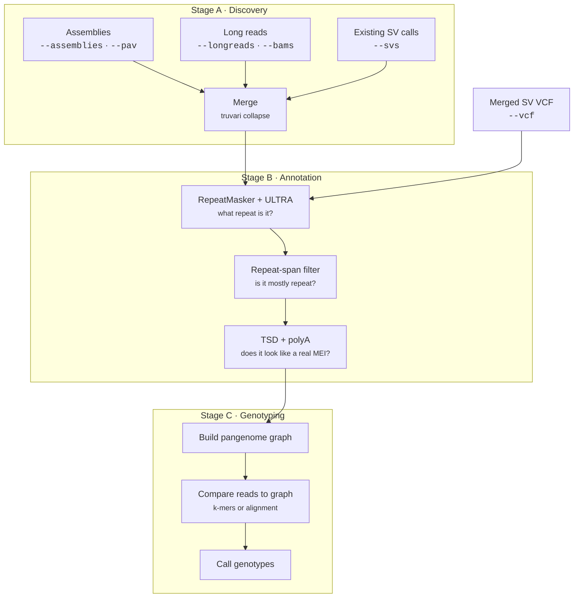

<h1 class="gt-masthead"></h1>

Pangenomic toolbox for the analysis of transposable element insertion polymorphisms.

!!! info "Applies to GraffiTE v1.1"
    Verified against `v1.1dev` at commit `583f603`. The
    [2024 paper](https://www.nature.com/articles/s41467-024-53294-2) describes v1.0, which
    differs in places; see [v1.0 vs v1.1](getting-started/v1.0-vs-v1.1.md).

GraffiTE takes genome assemblies or long-read datasets, finds the structural variants that are
transposable element (TE) insertions or deletions relative to a reference genome, annotates what
those elements are, and then genotypes each polymorphism in as many read sets as you like by
building a pangenome graph in which every TE is a bubble.

It handles both **non-reference** insertions (a TE present in your sample, absent from the
reference) and **reference** insertions (a TE present in the reference, absent from your sample).
It can also be used purely as an annotator: hand it a VCF of structural variants and it will tell
you which of them are TEs.

---

## The three stages

Every GraffiTE run is some subset of three stages in series, plus an optional fourth. Which stages
run depends on which inputs you supply.

**Stage A, discovery.** Each assembly or read set is aligned to the reference, structural
variants are called, and only insertions and deletions are kept. Multiple callers and multiple
input types can be mixed in one run; everything is merged into a single non-redundant SV set.

**Stage B, annotation.** Every candidate SV allele is scanned against your TE library with
RepeatMasker and against itself with ULTRA (tandem repeats). Variants that are not mostly repeat
are discarded. Survivors are annotated with their repeat identity, target site duplications and
polyA tails.

**Stage C, genotyping.** The annotated polymorphisms are induced into a pangenome graph as
bubbles, and each sample is genotyped at every polymorphism. The default back end,
`--graph_method pangenie`, counts k-mers against a PanGenie index and never aligns; `giraffe`
and `graphaligner` map the reads onto the graph and call genotypes with `vg call`.

**Methylation, optional.** With `--epigenomes`, on the `giraffe`, `graphaligner` and
`precomputed` graph methods (every method but `pangenie`), the base modifications carried by the
genotyping BAMs are lifted onto the graph and summarised per polymorphism. This step lives in the
`panmethyl` submodule. See [Methylation](guides/methylation.md).

Stage C is optional (`--genotype false`). Stages A and B can each be skipped by supplying their
outputs directly; see [Resuming and skipping work](guides/skipping-work.md).

---

## Reference and non-reference insertions

GraffiTE reports variants **relative to the reference genome**, so an ALT allele and the presence
of the TE do not always agree. Read the direction off the allele lengths: ALT longer than REF is a
non-reference insertion, REF longer than ALT is a reference insertion. `SVLEN` is positive for the
first and negative for the second. Do not use `SVTYPE` for this. On any run with two or more
caller VCFs, `truvari_merge` strips every upstream INFO field before the collapse and adds back
only `SVLEN`, so `pangenome.vcf` has no `SVTYPE`. It survives only on the single-input paths,
`--vcf` and a single caller VCF.

<figure>
--8<-- "assets/ref-vs-nonref-insertion.svg"
<figcaption>
ALT longer than REF means the element is <em>absent</em> from the reference and
<em>present</em> in the sample. REF longer than ALT means the element is <em>present</em> in
the reference and <em>absent</em> from the sample. The <code>SVTYPE</code> values shown appear
only on the single-input paths. In both cases the element itself is what GraffiTE annotated.
</figcaption>
</figure>

So **an ALT allele does not mean "TE present"**. For `DEL` records the relationship is inverted.
`vcf_to_pa_tsv.py` writes the presence-absence TSVs, and it reads presence off `INFO/SVTYPE`.
With more than one input VCF, `truvari_merge` strips INFO and puts back only `SVLEN`, so no record
carries `SVTYPE` and every sample column comes out `NA`. On a single input VCF the sample columns
hold `1` for present and `0` for absent, whichever way the record points. See
[Output files](reference/outputs.md).

---

## Glossary

Where the codebase uses a term loosely, this table states the meaning that applies here.

| Term | Meaning |
|---|---|
| **pME** | Polymorphic mobile element. A mobile element insertion that is present in some haplotypes and absent in others. |
| **Non-reference insertion** | TE present in the sample, absent from the reference. ALT longer than REF, `SVLEN` positive. |
| **Reference insertion** | TE present in the reference, absent from the sample. REF longer than ALT, `SVLEN` negative. |
| **Hit** | One RepeatMasker match after fragment grouping, a single element. Counted by the `n_hits` INFO field. |
| **Fragment** | One raw line of RepeatMasker output. Several fragments may be grouped into one hit. Counted by `fragmts`. |
| **Repeat span** | The fraction of a variant's sequence covered by the non-redundant union of RepeatMasker TE hits and ULTRA tandem repeats. The `total_repeat_span` INFO field; the main quality filter. |
| **Trusted subset** | A conservative subset of `pangenome.vcf`: single-hit, long enough, not dominated by tandem repeat, and polyA-supported if it is a non-LTR element. Written to `pangenome.trusted.vcf`. |
| **Human pME subset** | With `--human`, a subset filtered to recent human mobile element subfamilies (AluY, L1HS, SVA_D/E/F, HML-2). Written to `pangenome.human.vcf`, **instead of** the trusted subset. |
| **TSD** | Target site duplication. A short direct repeat flanking a genuine mobile element insertion, created by the integration mechanism. |
| **Locus** (HERV-K) | With `--human`, the set of records that describe the same HML-2 element. Two records share a locus when they touch the same reference HML-2 element, or when their footprints lie within `--hervk_locus_window` (`1200` bp) of each other. Named by the `HERVK_LOCUS` INFO field. |
| **Consolidated VCF** | With `--human`, a VCF in which each HERV-K locus is one record with per-allele states (`pangenome.human.consolidated.vcf`, and `GraffiTE.merged.genotypes.human.vcf.gz` after genotyping). |
| **Precomputed** | The `--graph_method precomputed` mode: no graph is built and no reads are mapped; the run reuses a `--graph` directory with `--vcfs` or `--graph_alignments` from an earlier run. |
| **Stage A / B / C** | Discovery / annotation / genotyping, as above. |

---

## Where to go next

- :material-download: **[Installation](getting-started/installation.md)**

    Prerequisites, cloning with submodules, and the container image.

- :material-rocket-launch: **[Quickstart](getting-started/quickstart.md)**

    Run the bundled human chromosome-22 test dataset end to end.

- :material-sign-direction: **[Choosing your inputs](getting-started/choosing-your-inputs.md)**

    A decision tree from "what data do I have" to "which flags do I pass".

- :material-tune: **[Parameters](reference/parameters.md)**

    Every parameter, its default, and what it controls.

- :material-file-tree: **[Output files](reference/outputs.md)**

    What GraffiTE writes and where.

- :material-dna: **[Human MEIs](guides/human-mei.md)**

    The `--human` filter and the HERV-K classifier.

- :material-flask-outline: **[Methylation](guides/methylation.md)**

    Lift base modifications from the genotyping BAMs onto the graph with `--epigenomes`.

- :material-compare: **[v1.0 vs v1.1](getting-started/v1.0-vs-v1.1.md)**

    What changed since the paper, flag by flag and field by field.

---

## Citing GraffiTE

> Groza, C., Chen, X., Wheeler, T.J. et al. A unified framework to analyze transposable element
> insertion polymorphisms using graph genomes. *Nature Communications* **15**, 8915 (2024).
> [doi:10.1038/s41467-024-53294-2](https://doi.org/10.1038/s41467-024-53294-2)

GraffiTE was developed by **Cristian Groza** and **Clément Goubert** in
[Guillaume Bourque's group](https://computationalgenomics.ca/BourqueLab/) at the
[McGill Genome Centre](https://www.mcgillgenomecentre.ca/), Montréal, Canada. It builds on the
concept described in [Groza et al., 2022](https://link.springer.com/protocol/10.1007/978-1-0716-2883-6_5).

Bugs, comments and suggestions are welcome in the
[issue tracker](https://github.com/cgroza/GraffiTE/issues).
