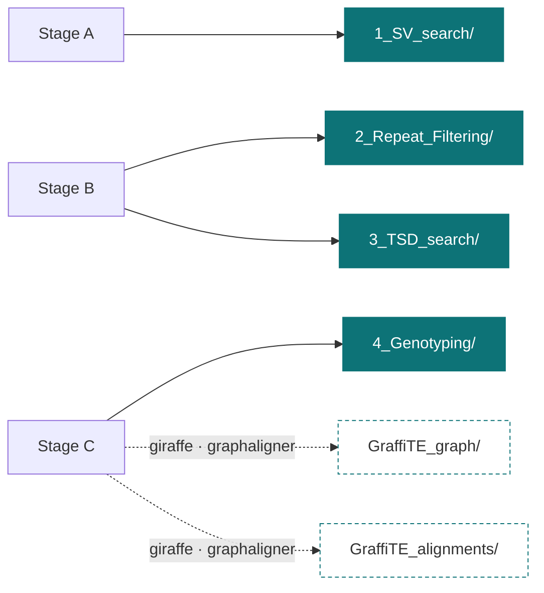

# Output files

!!! info "Applies to GraffiTE v1.1"
    This page documents the `v1.1dev` branch at commit `18a76d9`.
    Behaviour described in the [2024 paper](https://www.nature.com/articles/s41467-024-53294-2)
    corresponds to v1.0 and differs in places.


!!! warning "Draft scaffold"
    This page is a structural placeholder. Content is written in the next increment;
    the headings below are the agreed outline, not finished text.


## Directory layout

Everything below is relative to `--out` (default `out/`). Every `publishDir` uses `mode: 'copy'`.

```text
out/
├── 1_SV_search/
│   ├── SVs.vcf                                  ← truvari_merge
│   ├── svim-asm_individual_VCFs/<sample>.vcf.gz ← svim_asm
│   ├── sniffles2_individual_VCFs/*.vcf.gz       ← sniffles_population_call
│   └── pav_individual_VCFs/sv_<sample>.vcf.gz   ← pav_asm
├── 2_Repeat_Filtering/
│   └── <N>/                                     ← repeatmask_VCF, one dir per contig chunk
│       ├── genotypes_repmasked_filtered.vcf
│       ├── repeatmasker_dir/
│       ├── ultra_out.bed  ultra_out.span  ultra_out.stats
│       ├── total_repeat_span.tsv  union.bp  combined.stats
│       └── vcf_annotation.bak.txt
├── 3_TSD_search/                                ← concat_repeatmask
│   ├── pangenome.vcf
│   ├── pangenome.presence-absence.tsv
│   ├── pangenome.trusted.vcf                    (default; NOT written with --human)
│   ├── pangenome.presence-absence_trusted.tsv   (default; NOT written with --human)
│   ├── pangenome.human.vcf                      (--human only)
│   ├── pangenome.presence-absence_human.tsv     (--human only)
│   ├── pangenome.human.consolidated.vcf         (--human only)
│   ├── human_filter_summary.txt                 (--human only)
│   ├── hervk_polymorphism_summary.md            (--human only)
│   ├── hervk_loci.tsv  hervk_calls.tsv          (--human only)
│   ├── hervk_arch.tsv  hervk_refstate.tsv       (--human only)
│   ├── hervk_candidates.vcf                     (--human only)
│   ├── hervk_discovery_consolidation_report.md  (--human only)
│   ├── TSD_summary.txt
│   └── TSD_full_log.txt
├── 4_Genotyping/
│   ├── <sample>_genotyping.vcf.gz(.tbi)         ← pangenie, pangenie method only
│   ├── GraffiTE.merged.genotypes.vcf.gz         ← merge_VCFs
│   ├── GraffiTE.merged.genotypes.human.vcf.gz   (--human only)  ← hervk_reconcile
│   ├── hervk_unconsolidated_records.vcf         (--human only)
│   └── hervk_reconciliation_report.md           (--human only)
├── GraffiTE_graph/index/                        ← make_graph, giraffe/graphaligner only
└── GraffiTE_alignments/                         ← graph_align_reads
```

Which subset appears depends on the entry point and the graph method:



!!! note "The headline file"
    For most users the file that matters is **`3_TSD_search/pangenome.vcf`** (all annotated
    polymorphisms) or its filtered companion — `pangenome.trusted.vcf` by default, or
    `pangenome.human.vcf` with `--human`. If you genotyped, it is
    **`4_Genotyping/GraffiTE.merged.genotypes.vcf.gz`**, which carries the same annotations plus
    per-sample genotypes.

!!! note "Reading HERV-K with `--human`"
    GraffiTE can emit several VCF records for one HERV-K locus: two
    breakpoints for one insertion, or a deletion and an insertion describing
    opposite directions of the same event. The `.consolidated.` and `.human.`
    VCFs hold each locus as one multi-allelic record. Read those for HERV-K.
    The files they are built from stay as they are, because the discovery VCF
    induces the graph and the merged genotypes VCF is the native record of what
    `vg call` did.

    | want | read |
    |---|---|
    | HERV-K loci before genotyping | `3_TSD_search/pangenome.human.consolidated.vcf` |
    | HERV-K loci with genotypes | `4_Genotyping/GraffiTE.merged.genotypes.human.vcf.gz` |
    | every other TE family | `pangenome.human.vcf` or `GraffiTE.merged.genotypes.vcf.gz` |

    `INFO/HERVK_MEI` marks the loci where a null allele segregates. Those are
    the ones comparable to an *Alu*, L1 or SVA insertion. See
    [VCF fields](vcf-fields.md#herv-k-info-fields).


## 1_SV_search


## 2_Repeat_Filtering


## 3_TSD_search


## 4_Genotyping


## GraffiTE_graph


## GraffiTE_alignments


## Presence-absence TSVs


## What is not published
