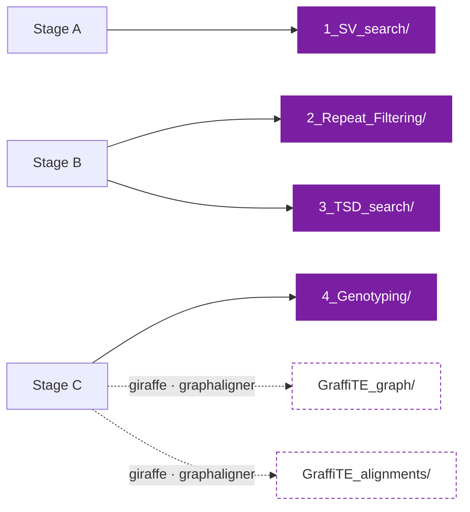

# Output files

!!! info "Applies to GraffiTE v1.1"
    Verified against `v1.1dev` at commit `4c8e385`. The
    [2024 paper](https://www.nature.com/articles/s41467-024-53294-2) describes v1.0, which
    differs in places; see [v1.0 vs v1.1](../getting-started/v1.0-vs-v1.1.md).

## Directory layout

Everything below is relative to `--out` (default `out/`). Every `publishDir` copies rather than
links, so the tree stands on its own once `work/` is deleted.

```text
out/
├── 1_SV_search/
│   ├── SVs.vcf                                  ← truvari_merge
│   ├── svim-asm_individual_VCFs/<sample>.vcf.gz ← svim_asm
│   ├── sniffles2_individual_VCFs/*.vcf.gz       ← sniffles_population_call
│   └── pav_individual_VCFs/sv_<sample>.vcf.gz   ← pav_asm
├── 2_Repeat_Filtering/
│   └── <N>/                                     ← repeatmask_VCF, one dir per contig
│       ├── genotypes_repmasked_filtered.vcf
│       ├── genotypes_repmasked.vcf.gz
│       ├── repeatmasker_dir/
│       ├── ultra_out.bed  ultra_out.span  ultra_out.stats
│       ├── total_repeat_span.tsv  union.bp  combined.stats
│       └── vcf_annotation.bak.txt
├── 3_TSD_search/                                ← concat_repeatmask, then hervk_annotate
│   ├── pangenome.vcf
│   ├── pangenome.presence-absence.tsv
│   ├── pangenome.trusted.vcf                    (default; not written with --human)
│   ├── pangenome.presence-absence_trusted.tsv   (default; not written with --human)
│   ├── pangenome.human.vcf                      (--human only)
│   ├── pangenome.presence-absence_human.tsv     (--human only)
│   ├── pangenome.human.consolidated.vcf         (--human only)
│   ├── human_filter_summary.txt                 (--human only)
│   ├── hervk_polymorphism_summary.md            (--human only)
│   ├── hervk_loci.tsv  hervk_calls.tsv          (--human only)
│   ├── hervk_arch.tsv  hervk_refstate.tsv       (--human only)
│   ├── hervk_candidates.vcf                     (--human only)
│   ├── hervk_discovery_consolidation_report.md  (--human only)
│   ├── TSD_summary.txt
│   └── TSD_full_log.txt
├── 4_Genotyping/
│   ├── <sample>_genotyping.vcf.gz(.tbi)         ← pangenie, pangenie method only
│   ├── GraffiTE.merged.genotypes.vcf.gz         ← merge_VCFs
│   ├── GraffiTE.merged.genotypes.human.vcf.gz(.tbi)  (--human only)  ← hervk_reconcile
│   ├── hervk_unconsolidated_records.vcf         (--human only)
│   └── hervk_reconciliation_report.md           (--human only)
├── GraffiTE_graph/index/                        ← make_graph, giraffe/graphaligner only
└── GraffiTE_alignments/                         ← graph_align_reads, giraffe/graphaligner only
```

Which subset appears depends on the entry point and the graph method:



!!! note "The headline file"
    For most users the file that matters is `3_TSD_search/pangenome.vcf` (all annotated
    polymorphisms) or its filtered companion: `pangenome.trusted.vcf` by default, or
    `pangenome.human.vcf` with `--human`. If you genotyped, it is
    `4_Genotyping/GraffiTE.merged.genotypes.vcf.gz`, which carries the same annotations plus
    per-sample genotypes.

!!! note "Reading HERV-K with `--human`"
    GraffiTE can emit several VCF records for one HERV-K locus: two breakpoints for one
    insertion, or a deletion and an insertion describing opposite directions of the same event.
    The `.consolidated.` and `.human.` VCFs hold each locus as one multi-allelic record. Read
    those for HERV-K. The files they are built from stay as they are, because the discovery VCF
    induces the graph and the merged genotypes VCF is the native record of what `vg call` did.

    | want | read |
    |---|---|
    | HERV-K loci before genotyping | `3_TSD_search/pangenome.human.consolidated.vcf` |
    | HERV-K loci with genotypes | `4_Genotyping/GraffiTE.merged.genotypes.human.vcf.gz` |
    | every other TE family | `pangenome.human.vcf` or `GraffiTE.merged.genotypes.vcf.gz` |

    `INFO/HERVK_MEI` marks the loci where a null allele segregates. Those are the ones
    comparable to an *Alu*, L1 or SVA insertion. See [VCF fields](vcf-fields.md).

## 1_SV_search

Stage A output. Present whenever discovery ran, so absent with `--vcf`, `--RM_dir` and
`--graffite_vcf`.

| File | Contents | Source |
|---|---|---|
| `SVs.vcf` | The merged, non-redundant set of insertions and deletions from every caller and sample, sorted, with `SVLEN` recomputed from the alleles and IDs shortened to `<caller id>_<n>`. Missing genotypes are set to `0`. This is the file Stage B annotates. With `--vcf`, it is a copy of the input. | <span class="src">`module/main.nf:159,167,230-232`</span> |
| `svim-asm_individual_VCFs/<sample>.vcf.gz` | One file per assembly: svim-asm calls of at least 100 bp, insertions and deletions only, sorted. | <span class="src">`module/main.nf:141,153-154`</span> |
| `sniffles2_individual_VCFs/<sample>.vcf.gz` | One file per read set, split from the Sniffles2 population call of at least 100 bp, insertions and deletions only, symbolic alleles dropped. | <span class="src">`module/main.nf:86,97-101`</span> |
| `pav_individual_VCFs/sv_<sample>.vcf.gz` | One file per sample: PAV calls with `abs(SVLEN)` above 50 bp. PAV's own filters (`TRIM`, `COMPOUND`) stay in `FILTER`. | <span class="src">`module/main.nf:107,137`</span> |

The `--svs` input is passed straight to the merge and is not copied here.

## 2_Repeat_Filtering

One directory per contig of `SVs.vcf`, numbered by task index, so `1/` is not necessarily
chromosome 1. Each holds the RepeatMasker and ULTRA run on that contig's variants and the
intermediate tables the span filter was computed from. The whole directory is what `--RM_dir`
reads back in to skip Stage B's masking step.
<span class="src">`module/main.nf:592-606`, `main.nf:133-142`</span>

| File | Contents | Source |
|---|---|---|
| `genotypes_repmasked_filtered.vcf` | The contig's records that passed `total_repeat_span > --repeat_span_cutoff`, with the repeat annotation fields. The TSD search reads this file. | <span class="src">`module/main.nf:615`</span> |
| `genotypes_repmasked.vcf.gz` | The same records before the span filter, so a dropped variant can be inspected. | <span class="src">`module/main.nf:614`</span> |
| `repeatmasker_dir/` | RepeatMasker's own output on `indels.fa`, the FASTA of every variant's inserted or deleted sequence: `indels.fa.out` is the table `annotate_vcf.R` parses, and the `RM_hit_IDs` field points into its last column. | <span class="src">`bin/repmask_vcf.sh:18-32`</span> |
| `ultra_out.bed` | ULTRA's tandem repeat intervals, one BED line per repeat, the variant ID as the sequence name. | <span class="src">`bin/repmask_vcf.sh:39-45`</span> |
| `ultra_out.span` | Non-redundant tandem-repeat bases per variant. | <span class="src">`bin/repmask_vcf.sh:49-51`</span> |
| `ultra_out.stats` | Variant ID, `ULTRA_TR`, `ULTRA_TR_span`. | <span class="src">`bin/repmask_vcf.sh:82-84`</span> |
| `union.bp` | Bases covered by the union of TE hits and ULTRA intervals, per variant. | <span class="src">`bin/repmask_vcf.sh:89-91`</span> |
| `total_repeat_span.tsv` | Variant ID and `total_repeat_span`. | <span class="src">`bin/repmask_vcf.sh:92-94`</span> |
| `combined.stats` | Variant ID, `ULTRA_TR`, `ULTRA_TR_span`, `total_repeat_span`, one row per variant with a hit in either tool. | <span class="src">`bin/repmask_vcf.sh:98-99`</span> |
| `vcf_annotation.bak.txt` | The annotation table handed to `bcftools annotate`, one row per variant, before compression. | <span class="src">`bin/repmask_vcf.sh:103-109`</span> |

## 3_TSD_search

Stage B's deliverables. `concat_repeatmask` writes everything except the `hervk_*` files, then,
under `--human`, `hervk_annotate` writes its own files into the same directory and overwrites
`pangenome.human.vcf` and `pangenome.presence-absence_human.tsv` with annotated versions. The
`pangenome.human.vcf` you find on disk is therefore the HERV-K-annotated one.
<span class="src">`module/main.nf:463-479`, `module/main.nf:253-273`</span>

| File | Contents | Source |
|---|---|---|
| `pangenome.vcf` | Every variant from every contig that passed the span filter, with REF and ALT re-read from the reference, `TSD` and `polyA` added, and the caller's `FILTER` kept. This file induces the pangenome graph, so nothing downstream modifies it. | <span class="src">`module/main.nf:531-546`</span> |
| `pangenome.trusted.vcf` | Default runs only. The records of `pangenome.vcf` that pass the trusted-subset expression in [Stage B](../guides/annotation.md). Not written under `--human`. | <span class="src">`module/main.nf:482-483,551-555`</span> |
| `pangenome.human.vcf` | `--human` only. The records that pass the pME filter in [Human MEIs](../guides/human-mei.md), with the HERV-K classifier fields and locus flags added by `hervk_annotate`. This file, not the consolidated one, is what the graph is built from under `--human`. | <span class="src">`module/main.nf:561`, `module/main.nf:264,335-340`</span> |
| `pangenome.human.consolidated.vcf` | `--human` only. `pangenome.human.vcf` with each HERV-K locus collapsed onto one multi-allelic record, genotypes taken from the assemblies. | <span class="src">`module/main.nf:353-359`</span> |
| `pangenome.presence-absence.tsv`, `..._trusted.tsv`, `..._human.tsv` | Flat tables of the matching VCF; see [Presence-absence TSVs](#presence-absence-tsvs). | <span class="src">`module/main.nf:549,555,562`</span> |
| `human_filter_summary.txt` | `--human` only. The exact `bcftools view -i` expression that was applied, record counts before and after, and the kept and dropped `(matching_classes, repeat_ids)` combinations with their counts. | <span class="src">`module/main.nf:564-579`</span> |
| `TSD_summary.txt` | One row per variant searched, the best duplication found and whether it passed. Columns are in [Target site duplications](../background/tsd.md). | <span class="src">`module/main.nf:529`, `bin/TSD_Match_v2.sh:116`</span> |
| `TSD_full_log.txt` | The full search log: both fragments with a ruler, every candidate duplication and the chosen one, per variant. | <span class="src">`module/main.nf:530`, `bin/TSD_Match_v2.sh:126`</span> |
| `hervk_candidates.vcf` | `--human` only. Every `LTR/ERVK` record of `pangenome.vcf` up to `--hervk_max_svlen`, classified, with its discovery genotypes. Wider than the human subset: a locus the `--human` filter split keeps all its members here. | <span class="src">`module/main.nf:301-329`</span> |
| `hervk_calls.tsv` | `--human` only. The per-candidate call table: id, position, `SVLEN`, class, allele states, evidence, `k`, `j`, reference units and period, reference state, `lambda`, `nu`, coverage, `pmap`, architecture, notes. | <span class="src">`bin/hervk_classify.py:478-480`</span> |
| `hervk_loci.tsv` | `--human` only. One row per locus: id, interval, member records, how many are in the human subset and which are not, reference state, allele set, locus type, the three flags, per-record class, evidence and `k`, architecture, and flags such as `LOCUS_SPLIT_BY_HUMAN_FILTER`. | <span class="src">`bin/hervk_reconcile.py:127-131`</span> |
| `hervk_arch.tsv` | `--human` only. The architecture read from the RepeatMasker fragments of each candidate: signature, permutation points, LTR family, termini, fragment count, LTR, internal and other bp, strand, internal gaps, architecture string. | <span class="src">`bin/hervk_arch.py:399-401`</span> |
| `hervk_refstate.tsv` | `--human` only. What the masked reference window holds at each candidate: state, unit count and period, LTR and internal bp, distance, the reference element's interval, flags, architecture. | <span class="src">`bin/hervk_ref_state.py:382-384`</span> |
| `hervk_polymorphism_summary.md` | `--human` only. Counts per class and per evidence type, the permutation points seen, and the unresolved candidates. | <span class="src">`bin/hervk_classify.py:649`</span> |
| `hervk_discovery_consolidation_report.md` | `--human` only. Per locus, the alleles and counts after consolidating the assembly genotypes, and the loci that were skipped and why. | <span class="src">`bin/hervk_reconcile.py:1246`</span> |

## 4_Genotyping

Stage C's deliverables, present when `--genotype` is true (the default).

| File | Contents | Source |
|---|---|---|
| `<sample>_genotyping.vcf.gz`, `.tbi` | PanGenie method only. Each read set's genotypes, split to one ALT per record so they match `pangenome.vcf` one for one. | <span class="src">`module/main.nf:688,695-704`</span> |
| `GraffiTE.merged.genotypes.vcf.gz` | All read sets merged into one VCF, one column per sample, with every INFO field of `pangenome.vcf` copied onto the matching record by position and alleles. The headline genotyped file. No `.tbi` is published for it; run `tabix -p vcf` on it before random access. | <span class="src">`module/main.nf:819-841`</span> |
| `GraffiTE.merged.genotypes.human.vcf.gz`, `.tbi` | `--human` only. The human subset of the merged genotypes, HERV-K annotation carried over from `pangenome.human.vcf`, and each HERV-K locus consolidated onto one record. Graph genotypes at copy-number loci are withheld unless `--hervk_mask_graph_gt_at_cnv false`. | <span class="src">`module/main.nf:375,386-387,401-443`</span> |
| `hervk_unconsolidated_records.vcf` | `--human` only. The member records each consolidated record was built from, as they were before consolidation. | <span class="src">`module/main.nf:388,439`</span> |
| `hervk_reconciliation_report.md` | `--human` only. Per locus, alleles, `AC`, `AN` against `2N`, resolved and partial samples; then the loci with ploidy exceeded, with `AN` below `2N`, and skipped. | <span class="src">`bin/hervk_reconcile.py:1246`</span> |

The per-sample `vg call` VCFs of the giraffe and graphaligner methods are not published; they can
be supplied back with `--vcfs` only if you keep them from `work/`.

## GraffiTE_graph

Giraffe and graphaligner methods only, unless `--graph` pointed at an existing directory. The
`index/` directory is what `--graph` takes.
<span class="src">`module/main.nf:709-741`, `main.nf:221-223`</span>

| File | Method | Contents | Source |
|---|---|---|---|
| `index/index.giraffe.gbz` | giraffe | The GBZ graph and indexes from `vg autoindex`. | <span class="src">`module/main.nf:725-727`</span> |
| `index/index.gfa` | both | The graph in GFA. `vg call` reads it on the graphaligner path, and the methylation module indexes it. | <span class="src">`module/main.nf:726,734`</span> |
| `index/index.pb` | both | The snarl decomposition `vg call` needs. | <span class="src">`module/main.nf:727,735`</span> |
| `index/index.vg` | graphaligner | The `vg construct` graph the GFA was converted from. | <span class="src">`module/main.nf:733`</span> |

## GraffiTE_alignments

Giraffe and graphaligner methods only, unless `--graph_alignments` supplied them. One pair per
read set, and exactly what `--graph_alignments` takes back.
<span class="src">`module/main.nf:763-771`, `main.nf:234-236`</span>

| File | Contents | Source |
|---|---|---|
| `<sample>.gaf.gz` | The alignments in GAF, reduced to the twelve standard columns plus the `cs` or `cg` tag, sorted by read name. | <span class="src">`module/main.nf:783,791`, `bin/subset_gaf.py`</span> |
| `<sample>.pack` | The `vg pack` coverage over the graph, alignments below `--min_mapq` excluded, which `vg call` genotypes from. | <span class="src">`module/main.nf:782,790`</span> |

## Presence-absence TSVs

Each `pangenome*.vcf` in `3_TSD_search/` has a flat companion written by `vcf_to_pa_tsv.py`.
The first 21 columns are fixed, then one column per sample:

```text
CHROM POS END ID SVTYPE SVLEN n_hits match_lengths repeat_ids matching_classes fragmts
RM_hit_strands RM_hit_IDs total_match_length total_match_span L1_5PINV ULTRA_TR
ULTRA_TR_span total_repeat_span TSD polyA <sample1> <sample2> ...
```

A missing INFO field is written as `NA`. The sample columns say whether the **element** is
present, whichever way the VCF record points:

| `SVTYPE` | genotype carries an ALT allele | all REF | missing |
|---|---|---|---|
| `INS` | `1` | `0` | `NA` |
| `DEL` | `0` | `1` | `NA` |

A `1` therefore always means the TE is in that sample. Under `--human`, the `_human.tsv` is
rewritten by `hervk_annotate` with the classifier's columns appended.
<span class="src">`bin/vcf_to_pa_tsv.py:4-15,42-53`, `module/main.nf:331-333`</span>

## What is not published

These stay in `work/` and vanish with it:

- The alignments of Stage A: `map_asm` and `map_longreads` BAMs, and the `.snf` files of `sniffles_sample_call`.
- `truvari_merge`'s intermediates: the stripped and merged inputs, the shards, the collapsed shards.
- The per-contig split of `SVs.vcf` and the TSD working files (`indels.fa`, the flank and end FASTAs, per-batch summaries).
- The PanGenie index (`pangenie_index/`) and the multi-allelic graph VCF it was built from.
- The per-sample `vg call` VCFs, the `.gam` alignments (deleted inside the task), and the FASTQ converted from a BAM in `--genotype_with`.
- `merge_VCFs`' sorted copy of `pangenome.vcf` and its uncompressed merge.

`nextflow run -with-report` and `-with-trace` are the way to see resource use per task; nothing
in `out/` records it.
