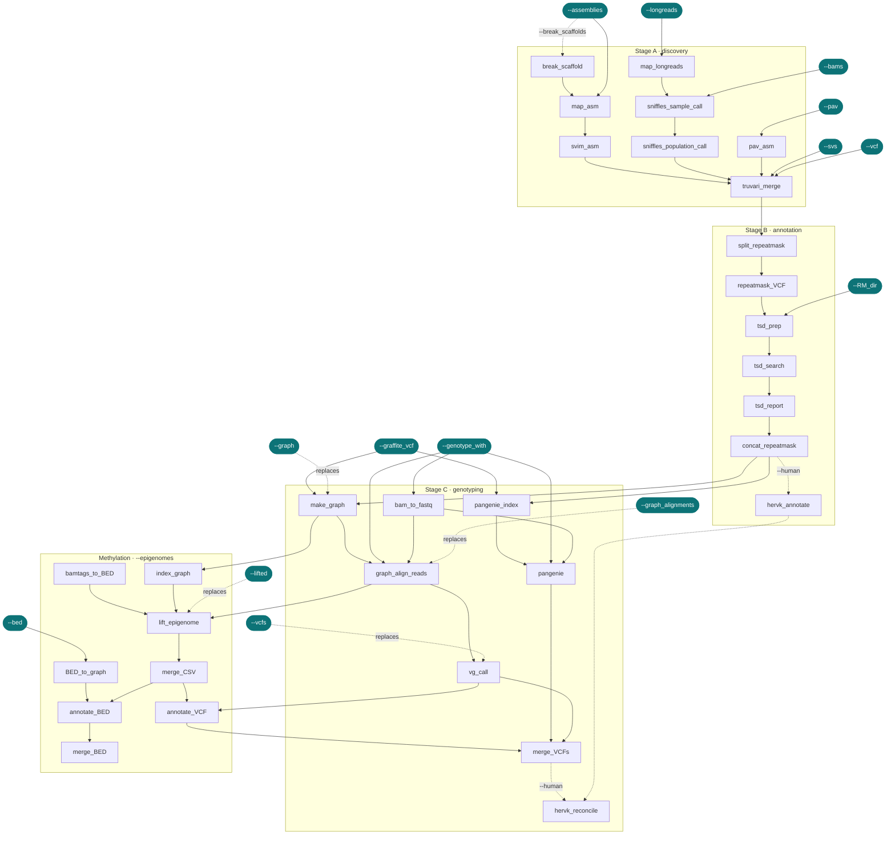

# Pipeline processes

!!! info "Applies to GraffiTE v1.1"
    Verified against `v1.1dev` at commit `4c8e385`. The
    [2024 paper](https://www.nature.com/articles/s41467-024-53294-2) describes v1.0, which
    differs in places; see [v1.0 vs v1.1](../getting-started/v1.0-vs-v1.1.md).

`module/main.nf` defines 23 processes. The methylation branch imports eight more from the
`panmethyl` submodule. The inputs you pass decide which ones run; a process with nothing on its
input channel is never scheduled. `main.nf:42-48`

Every process runs in the GraffiTE container except `pav_asm`, which has its own. Nextflow puts the
repository's `bin/` on `PATH` inside every task. `nextflow.config:322`

---

## Process graph

Dashed edges are taken only when the labelled parameter is set. `--graph`, `--graph_alignments`,
`--vcfs` and `--lifted` each replace the process they point at.

---

## Stage A: discovery

| Process | What it runs | Outputs | Published to | Resources |
|---|---|---|---|---|
| `break_scaffold` `module/main.nf:1` | `breakgaps.py` splits each assembly at runs of `N`. Only with `--break_scaffolds`. | `broken/<asm>.fa.gz` | not published | `cpus 1` `nextflow.config:172-174` |
| `map_asm` `module/main.nf:16` | `minimap2 -a -x <asm_divergence> --cs -r2k` (or winnowmap after `meryl count k=19`) piped into `samtools sort`. | `asm.sorted.bam` | not published | `map_asm_*` `nextflow.config:175-179` |
| `map_longreads` `module/main.nf:40` | `minimap2 -ax map-<type>` (or winnowmap, `k=15`) piped into `samtools sort`. | `<sample>.bam` | not published | `map_longreads_*` `nextflow.config:180-184` |
| `sniffles_sample_call` `module/main.nf:71` | `samtools index`, then `sniffles --minsvlen 100` per sample, writing a `.snf` for the joint call. | `<sample>.snf`, `<sample>.vcf` | not published | `sniffles_*` `nextflow.config:185-189` |
| `sniffles_population_call` `module/main.nf:85` | `sniffles` over every `.snf`; `bcftools filter` keeps `INS` and `DEL` with an explicit ALT sequence; `bcftools +split` into one VCF per sample. | `sniffles2_individual_VCFs/*.vcf.gz` | `1_SV_search/` | `sniffles_*` `nextflow.config:190-194` |
| `pav_asm` `module/main.nf:106` | Writes PAV's `assemblies.tsv` and `config.json`, runs `/opt/pav/files/docker/run`, keeps \|SVLEN\| above 50 bp. Own container. | `sv_<sample>.vcf.gz` | `1_SV_search/pav_individual_VCFs/` | `32` CPUs unless `--cores`, `pav_*` `nextflow.config:321-326` |
| `svim_asm` `module/main.nf:140` | `samtools index`, `svim-asm haploid --min_sv_size 100 --types INS,DEL`, renames the sample, `bcftools sort`. | `<asm>.vcf.gz` | `1_SV_search/svim-asm_individual_VCFs/` | `svim_asm_*` `nextflow.config:195-199` |
| `truvari_merge` `module/main.nf:158` | With `--vcf`: copies the file. Otherwise strips INFO, `bcftools merge -m none`, `truvari divide` into shards, `truvari collapse --chain -P 0.5 -p 0.5 -S -1 -k common` per shard in parallel, `bcftools concat`, `+setGT` to `0`, `norm`, `+fill-tags` recomputing `SVLEN`, then `shorten_ids.py`. One input file is copied without collapsing. | `SVs.vcf` | `1_SV_search/` | `svim_asm_*` `nextflow.config:200-204` |

---

## Stage B: annotation

| Process | What it runs | Outputs | Published to | Resources |
|---|---|---|---|---|
| `split_repeatmask` `module/main.nf:447` | Sorts and indexes `SVs.vcf`, writes one VCF per contig. | `<contig>.vcf` | not published | `repeatmasker_*` `nextflow.config:205-209` |
| `repeatmask_VCF` `module/main.nf:591` | One task per contig. `repmask_vcf.sh` runs RepeatMasker with `--TE_library`, ULTRA, `bedtools merge` and `annotate_vcf.R`; then `bcftools view` keeps `total_repeat_span` above `--repeat_span_cutoff`. | `genotypes_repmasked_filtered.vcf`, `repeatmasker_dir/`, `genotypes_repmasked.vcf.gz`, `ultra_out.{bed,span,stats}`, `union.bp`, `total_repeat_span.tsv`, `combined.stats`, `vcf_annotation.bak.txt` | `2_Repeat_Filtering/<task index>/` | `repeatmasker_*` `nextflow.config:215-219` |
| `tsd_prep` `module/main.nf:619` | `prepTSD.sh` with `--tsd_win`: lists the indels and extracts the flanks and trimmed variant ends. | `indels.txt`, `SV_sequences_L_R_trimmed_WIN.fa`, `flanking_sequences.fasta` | not published | `cpus 1`, `tsd_*` `nextflow.config:220-224` |
| `tsd_search` `module/main.nf:634` | One task per batch of `--tsd_batch_size` indels. `TSD_Match_v2.sh` with `--tsd_win` calls `exact_match.py` on each pair of fragments. | `*TSD_summary.txt`, `*TSD_full_log.txt`, `chrom.txt` | not published | `cpus 1`, `tsd_*` `nextflow.config:225-229` |
| `tsd_report` `module/main.nf:650` | One task per contig. Concatenates the batch summaries and writes `INFO/TSD` with `tsd_annotate_vcf.sh`. | `TSD_summary.txt`, `TSD_full_log.txt`, `pangenome.vcf` (per contig) | not published | `cpus 1`, `tsd_*` `nextflow.config:230-234` |
| `concat_repeatmask` `module/main.nf:462` | `bcftools concat` of the contigs, sort, the repeat-span filter again, `fix_vcf.py`, `add_polyA.py`, the presence-absence TSVs with `vcf_to_pa_tsv.py`, then `bcftools view -i` for the trusted subset, or for the `--human` subset plus `human_filter_summary.txt`. Stamps `##GraffiTE_version`. | `pangenome.vcf`, `pangenome.presence-absence.tsv`, `TSD_summary.txt`, `TSD_full_log.txt`, and either `pangenome.trusted.vcf` + `pangenome.presence-absence_trusted.tsv` or `pangenome.human.vcf` + `pangenome.presence-absence_human.tsv` + `human_filter_summary.txt` | `3_TSD_search/` | `repeatmasker_*` `nextflow.config:210-214` |
| `hervk_annotate` `module/main.nf:252` | `--human` only. Lists LTR/ERVK candidates up to `--hervk_max_svlen`, reads the raw RepeatMasker tables with `hervk_arch.py`, masks the reference windows with `hervk_ref_state.py` (RepeatMasker on `task.cpus` threads, or a supplied annotation), classifies with `hervk_classify.py`, flags loci with `hervk_reconcile.py flag`, and writes a consolidated discovery VCF. Overwrites the two human files from `concat_repeatmask`. | `pangenome.human.vcf`, `pangenome.presence-absence_human.tsv`, `hervk_loci.tsv`, `hervk_calls.tsv`, `hervk_arch.tsv`, `hervk_refstate.tsv`, `hervk_candidates.vcf`, `hervk_polymorphism_summary.md`, `pangenome.human.consolidated.vcf`, `hervk_discovery_consolidation_report.md` | `3_TSD_search/` (`overwrite: true`) | `hervk_annotate_*` `nextflow.config:271-275` |

---

## Stage C: genotyping

| Process | What it runs | Outputs | Published to | Resources |
|---|---|---|---|---|
| `bam_to_fastq` `module/main.nf:744` | For `.bam` rows of `--genotype_with`: strips tags, name-sorts, `samtools fastq`, `pigz`. | `<reads>.fq.gz` | not published | `graph_align_*` `nextflow.config:250-254` |
| `pangenie_index` `module/main.nf:667` | Drops genotypes from the annotated VCF, adds a `ref` sample, `bcftools norm -m+`, `merge_vcfs.py merge` at ploidy 2, `PanGenie-index`. | `pangenie_index/` | not published | `pangenie_*` `nextflow.config:235-239` |
| `pangenie` `module/main.nf:687` | `PanGenie` per read set, then `bcftools norm -m-` so records match `pangenome.vcf` one for one, and `tabix`. | `<sample>_genotyping.vcf.gz`, `.tbi` | `4_Genotyping/` | `pangenie_*` `nextflow.config:240-244` |
| `make_graph` `module/main.nf:708` | `bcftools +setGT` unphases the VCF. giraffe: `vg autoindex -w sr-giraffe -w lr-giraffe`, `vg convert` to GFA, `vg snarls`. graphaligner: `vg construct -a -m 1024`, `vg convert`, `vg snarls`. Skipped with `--graph`. | `index/` (`index.gfa`, `index.pb`, and `index.giraffe.gbz` for giraffe) | `GraffiTE_graph/` | `make_graph_*` `nextflow.config:245-249` |
| `graph_align_reads` `module/main.nf:762` | giraffe: `vg giraffe --parameter-preset <preset>` (with `-i` for short reads), `vg pack -Q <min_mapq>`, `vg convert` to GAF through `subset_gaf.py`. graphaligner: `GraphAligner -x vg`, then the same. Skipped with `--graph_alignments`. A failed sample lets the tasks already running finish before the run stops (`errorStrategy 'finish'`). | `<sample>.gaf.gz`, `<sample>.pack` | `GraffiTE_alignments/` | `graph_align_*` `nextflow.config:255-260` |
| `vg_call` `module/main.nf:800` | `vg call -a -A -R chrX:1,chrY:1 -m <min_support>` against the snarls, `bcftools norm -m-`, `bcftools sort`, `tabix`. Skipped with `--vcfs`. | `<sample>.vcf.gz`, `.tbi` | not published | `vg_call_*` `nextflow.config:261-265` |
| `merge_VCFs` `module/main.nf:818` | `bcftools merge -m none` of every per-sample VCF, then `bcftools annotate` copies INFO from `pangenome.vcf` by `CHROM,POS,ID,REF,ALT`, and stamps `##GraffiTE_version`. | `GraffiTE.merged.genotypes.vcf.gz` | `4_Genotyping/` | `cpus 1`, `merge_vcf_*` `nextflow.config:266-270` |
| `hervk_reconcile` `module/main.nf:374` | `--human` only. Subsets the merged genotypes to the human IDs, copies every `HERVK_*` INFO tag across from the discovery VCF, and runs `hervk_reconcile.py consolidate`, which masks graph genotypes at copy-number loci unless `--hervk_mask_graph_gt_at_cnv false`. With `--hervk_reconcile_vcf` the merged VCF comes from that file instead. | `GraffiTE.merged.genotypes.human.vcf.gz`, `.tbi`, `hervk_unconsolidated_records.vcf`, `hervk_reconciliation_report.md` | `4_Genotyping/` (`overwrite: true`) | `cpus 1`, `hervk_reconcile_*` `nextflow.config:276-280` |

`vg_call` passes `-R chrX:1,chrY:1`, so contigs named exactly `chrX` and `chrY` are called at ploidy
one. Other names for the sex chromosomes get ploidy two. `module/main.nf:811`

---

## Methylation processes

Imported from `panmethyl/module/main.nf` at submodule commit `bd1c383`; `--epigenomes` only, and
only inside the giraffe, graphaligner or precomputed branch. Their resources are fixed in
`nextflow.config` and have no parameter. `main.nf:42,245-269`

| Process | What it runs | Outputs | Published to | Resources |
|---|---|---|---|---|
| `index_graph` `panmethyl/module/main.nf:67` | Node sizes from the GFA, and `index_nucleotide.py` locating every `--motif` on the graph. | `node_sizes.csv`, `nodes_list.csv`, `index.csv.gz` | `index/` | `cpus 1`, `40 GB`, `6 h` `nextflow.config:296-300` |
| `bamtags_to_BED` `panmethyl/module/main.nf:136` | `tagtobed` extracts the `--code` modification calls from each genotyping BAM. Skipped with `--lifted`. | `<sample>.mods.gz` | not published | `cpus 2`, `50 GB`, `6 h` `nextflow.config:281-285` |
| `lift_epigenome` `panmethyl/module/main.nf:150` | Joins the calls with the sample's GAF and runs `lift_mods` to place them on graph nodes. | `<sample>.csv.gz` | `lifted/` | `cpus 1`, `60 GB`, `6 h` `nextflow.config:286-290` |
| `merge_CSV` `panmethyl/module/main.nf:168` | `nodes_levels.py` per input, then `merge_csvs.py` into one table per sample. | `<sample>.csv.gz` | `levels/` | `cpus 1`, `60 GB`, `6 h` `nextflow.config:291-295` |
| `annotate_VCF` `panmethyl/module/main.nf:1` | `annotate_vcf.py` adds methylation levels to the sample's `vg call` VCF; that VCF then goes to `merge_VCFs`. | `<sample>.mods.vcf.gz`, `.tbi`, `<sample>.mods.tsv` | `annotation/` | `cpus 1`, `40 GB`, `6 h` `nextflow.config:301-305` |
| `BED_to_graph` `panmethyl/module/main.nf:17` | `vg annotate` projects `--bed` onto the graph. | `annotation.gaf`, `annotation.bed` | not published | `cpus 1`, `40 GB`, `6 h` `nextflow.config:311-315` |
| `annotate_BED` `panmethyl/module/main.nf:30` | `annotate_bed.py` gives each BED feature the sample's levels. | `<sample>.bed` | `annotation/` | `cpus 1`, `40 GB`, `6 h` `nextflow.config:306-310` |
| `merge_BED` `panmethyl/module/main.nf:45` | Pastes the per-sample columns into one table. | `merged_epiannoation.bed` | `annotation/` | `cpus 1`, `40 GB`, `6 h` `nextflow.config:316-320` |

The methylation directories are published directly under `--out`, next to the numbered stage
directories. See [Methylation](../guides/methylation.md) and
[Output files](outputs.md).

---

## Resource selectors

Each process is matched by a `withName` block in `nextflow.config`. The `cpus` line of most blocks
reads `params.cores ? params.cores : params.<process>_threads`, so `--cores` overrides every
configurable thread count at once. The processes fixed at one CPU (`break_scaffold`, the three
`tsd_*`, `merge_VCFs`, `hervk_reconcile`) and the methylation processes ignore it.
`nextflow.config:171-327`

The full table of parameters is in [Parameters](parameters.md); the same table grouped by process is
in [Resources and scaling](../guides/resources.md).
